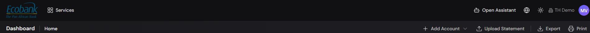
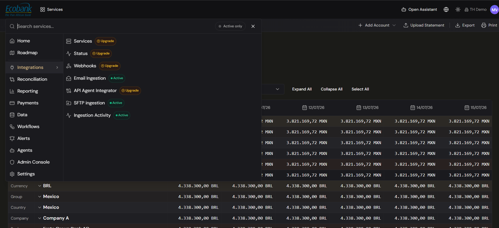

# Navigation & Your Workspace

> **Availability:** `Available` ✅
> **Who this is for:** everyone using the platform.

## Overview
Treasury Hub is a single web application. Everything is reached from a **left sidebar** of modules
and a **top bar** with global tools. What you see in the sidebar depends on your
[permissions](04-roles-and-permissions.md) and on which modules your organization has enabled.

## The top bar
From left to right, the top bar gives you:
- **Logo / brand** — returns you to Home. (In white-label deployments this is your brand.)
- **Services** — the launcher that opens the "Search services…" overlay to find any module or screen.
- **Open Assistant** — opens the in-app AI assistant for help, guided setup, and questions.
- **Language switch** — toggle between **English** and **Spanish**.
- **Theme switch** — toggle **light / dark** mode.
- **Tenant name** — the organization you're currently working in (e.g. "TH Demo").
- **Your avatar** — profile, tenant switching (if you belong to more than one), and sign out.

Just below the top bar, each screen shows a **breadcrumb** (e.g. *Dashboard › Home*) on the left and
that screen's **action bar** (e.g. Add Account, Upload Statement, Export, Print) on the right.

## The sidebar (main menu)
The sidebar mirrors how the platform is organized. Sections with a **›** expand to reveal screens.

| # | Section | What's inside |
|---|---------|---------------|
| 1 | **Home** | Your cash position dashboard. |
| 2 | **Roadmap** | What's shipped, what's coming, and your treasury journey. |
| 3 | **Integrations** | Services, Status, Webhooks, Email Ingestion, API Agent Integrator, SFTP Ingestion, Ingestion Activity. |
| 4 | **Reconciliation** | Dashboard, Reconciliation Status, 1-to-1 Matching, Batch Matching, Approvals, ERP Posting (Publishing). |
| 5 | **Reporting** | Summary (Dashboard, Audit); Cash & Liquidity; Operations blotters; Risk Management. |
| 6 | **Payments** | Payment Blotter, Payment Lifecycle Blotter, Payment Approvals, Net Settlements. |
| 7 | **Data** | Data Hub, Data Repository, Data Export, Financial Events. |
| 8 | **Workflows** | Workflow Dashboard, Workflow Approvals. |
| 9 | **Alerts** | Alerts from every module in one place. |
| 10 | **Agents** | Agent Dashboard, Agent Builder, Agent Approvals, Agent Chats, Agent Logs. |
| 11 | **Admin Console** | User & Agent Management, Access Tokens, Master Data. |
| 12 | **Settings** | Configuration: Parsing Templates, Workflow Builder, Reconciliation Flows/Criteria, custom Data Exports. |

> **"Active" vs "Upgrade" badges:** inside the menus, an item shows a green **Active** badge when it's
> live for your organization, or an orange **Upgrade** badge when it's a **premium** module.

## Working with data grids
Most screens are powerful data grids (blotters). Across the platform you can generally:
- **Add** a record (e.g. **+ Add Account**), **Upload** a file (e.g. **Upload Statement**),
  **Export**, and **Print** from the action bar.
- **Filter** with tabs (e.g. All / Exceptions / Disconnected) and an **Active only** toggle.
- **Expand All / Collapse All** and **Select All** in hierarchical views.
- **Group** balances and figures by **Currency, Group, Country, Company**, and drill down.
- **Choose the display currency** so all balances convert to one currency of your choice.
- Open a **detail panel** by selecting a row.
- Your **view state** (filters, grouping, columns) is remembered between visits.

## Switching organizations (tenants)
If you belong to more than one organization, your tenant name appears next to your avatar and is
clickable. Open the avatar menu and pick another organization to switch. Treasury Hub reloads with
that organization's data. If you belong to a single organization, the name is shown but not
clickable. You only ever see data for your current organization.

## Related
- [Roles & Permissions](04-roles-and-permissions.md) — why some menu items are hidden.
- [Home Dashboard](../01-home/home-dashboard.md)
