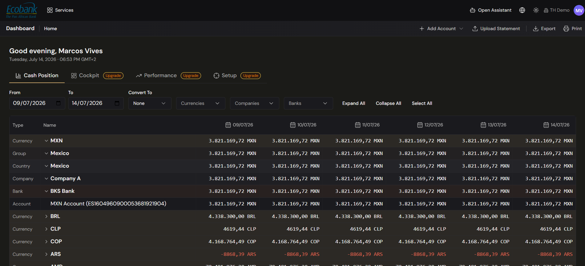

# Home — Cash Position Dashboard

> **Availability:** `Available` ✅ (core cash position is live; the Ona-powered Setup, Performance and Cockpit tabs are `In Preview` 👁️ — see below)
> **Where to find it:** Home
> **Who uses it:** treasurers, cash managers, finance teams, CFOs — anyone who needs to see where the money is.
> **Permissions required:** `CashManagement.CashPosition` · Read (see [Roles & Permissions](../00-getting-started/04-roles-and-permissions.md)).

## Overview
Home is your landing page after signing in. It gives you a **real-time view of your organization's
cash position** — how much money you hold, in which currencies, at which banks, across which
companies and countries — laid out as a single grouped table with a **column for each date** in the
range you choose, so you can read balances day by day.

Instead of logging into each bank portal and stitching balances together in a spreadsheet, you get
one consolidated, always-current picture the moment you open the platform. From here you can drill
into the full [Cash Position report](../06-reporting/overview.md) when you need transaction-level
detail.

## Key concepts
- **Balance** — the amount of money held, aggregated to whatever level you're looking at (a single
  account, a company, a currency, or the whole group).
- **Grouping hierarchy** — balances roll up through levels shown in the **Type** column:
  **Currency → Group → Country → Company → Bank → Account**. You expand or collapse levels to move
  between the big picture and a single account.
- **Date columns** — the table shows one column per date across the range you set, so you see each
  day's balance side by side.
- **Convert To (display currency)** — a single currency you pick so every balance on the page is
  converted into it for one comparable total; choose **None** to keep each account in its native
  currency. See [Core Concepts](../00-getting-started/03-core-concepts.md#company-structure) for how
  the Company Group › Company › Account hierarchy underpins these totals.

## Before you start
- At least one **bank account** must exist, with balance data. If none does, Home shows an empty
  state prompting you to **add an account or upload a statement** — see
  [Bank Accounts](../06-reporting/bank-accounts.md).
- To convert balances into a display currency, **exchange rates** must be loaded for the currency
  pairs involved (managed under Master Data / Exchange Rates).
- You need `CashManagement.CashPosition` at Read level. Without it, the Home menu item is hidden and
  you're routed to the first screen you can access.

## How to use it

### Read your consolidated cash position
1. Open **Home** from the sidebar (it's also where the logo takes you). The **Cash Position** tab is
   selected by default.
2. Read the balance table: the **Type** and **Name** columns on the left show each grouping level
   (Currency, Group, Country, Company, Bank, Account), and each **date column** to the right shows
   the balance on that day.
3. Use **Expand All** / **Collapse All** (or the ▸ arrows on a row) to open a currency down to its
   companies, banks and individual accounts — or roll everything back up.

### Change the time period
1. Set the **From** and **To** date fields in the control row at the top of the dashboard.
2. The table redraws with one **column per date** across that range.

### Focus on specific currencies, companies or banks
1. Use the **Currencies**, **Companies**, and **Banks** dropdowns in the control row to filter the
   table to just what you want to see.
2. Combine filters as needed; the totals recalculate to match your selection.

### See everything in one currency
1. Open the **Convert To** dropdown in the control row (next to the date fields).
2. Select a currency (for example, USD). Every balance and total re-renders **converted** into that
   currency, so you can compare across the group on a like-for-like basis.
3. To go back to seeing each account in its own native currency, choose **None**.

> If an account's currency has no exchange rate to your chosen display currency for the selected
> dates, that value is shown as a dash or an "FX unavailable" marker and is left out of the
> converted total, with a note — so a missing rate never silently distorts your figures.

### Add data or export
- Use **+ Add Account** and **Upload Statement** (top-right) to bring in more balances, and
  **Export** or **Print** to take the current view with you.

### Drill into the detail
For transaction-level analysis — opening balance, inflows, outflows, net flow and closing balance,
drilled all the way down through **Currency › Group › Country › Company › Bank › Account › Tag ›
Transaction** — open the full **Cash Position** report under
[Reporting](../06-reporting/overview.md). That report also lets you toggle **Actuals vs Forecast**
and group columns by **Days, Weeks or Months**.

## Configuration
Home is view-only — you don't set data up here, you set it up upstream:
- **Accounts, companies and company groups** — configured in the [Admin Console](../10-admin-console/overview.md);
  the hierarchy you define there is exactly what the grouping tabs consolidate.
- **Exchange rates** — required for currency conversion; managed in Master Data.
- **Your view state** (chosen tab, grouping, date range, display currency) is remembered between
  visits, so Home opens the way you left it.

## Tips & good practices
- Set **Convert To** to your reporting currency so the headline total is immediately meaningful to
  management.
- Keep your **company structure and account list clean** — Home is only as accurate as the master
  data behind it (see [Core Concepts](../00-getting-started/03-core-concepts.md#master-data)).
- Expand to the **Bank** level to spot bank concentration, and read balances at the **Country** level
  to check cross-border exposure before it becomes a risk.
- If a currency total looks off, check for an **"FX unavailable"** marker — it usually means a
  missing exchange rate rather than a real cash movement.

## Related
- [Reporting — Cash Position](../06-reporting/overview.md) — the full drill-down report with
  actuals/forecast and transaction detail.
- [Navigation & Your Workspace](../00-getting-started/02-navigation-and-workspace.md) — the sidebar,
  top bar, and shared grid behaviors.
- [Core Concepts](../00-getting-started/03-core-concepts.md) — company hierarchy and master data
  behind the totals.
- [Roadmap](roadmap.md) — what's shipped and what's coming.

## In Preview
The demo shows Home evolving from a cash dashboard into a **personalized cockpit** curated for your
roles by **Ona**, your personal coach agent. These tabs are in testing (available on request):
- 👁️ **Cockpit tab** — a personalized grid of KPIs, approval queue, featured reports and alerts,
  each tagged with the role that makes it relevant to you.
- 👁️ **Performance tab** — Ona's daily briefing, meeting prep, and progress against daily/weekly/
  monthly objectives.
- 👁️ **Setup tab** — Ona configures your work routines from the roles and workflows she manages in
  the Admin Console.

Ona and the other named agents are tracked on the [Agents](../09-agents/overview.md) page. The
demo KPI figures and personas you may see in previews are illustrative examples, not your data.
