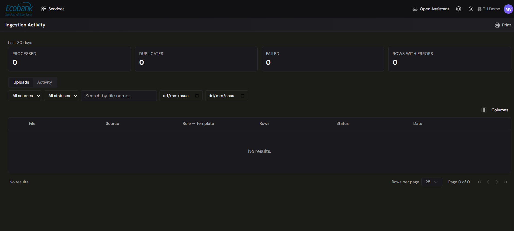

# Ingestion Activity

> **Availability:** `Available` ✅ — shown **Active** in the platform.
> **Where to find it:** Integrations › Ingestion Activity
> **Who uses it:** treasury operations, finance systems owners, administrators.
> **Permissions required:** read access to the data being ingested; see [Roles & Permissions](../00-getting-started/04-roles-and-permissions.md).

## Overview
Ingestion Activity is the monitor for everything coming into Treasury Hub. Across the top, **Last 30
days** tiles summarize activity — **Processed**, **Duplicates**, **Failed**, and **Rows with errors**
— and below them a grid lists each file that has come in, from which source, which rule and template
processed it, how many rows it held, whether it succeeded, and when. It's the screen to check when you
want to confirm your data is complete and current before relying on your cash position or
[reconciliation](../04-reconciliation/overview.md).

## Key concepts
- **Processed / Duplicates / Failed / Rows with errors** — the **Last 30 days** summary tiles: how
  many files were processed, how many were duplicates, how many failed, and how many rows within
  processed files had errors.
- **Source** — the connector or channel the item arrived on (bank, PSP, ERP, file, email, SFTP, API).
- **Rule → Template** — the ingestion rule and the file template used to parse the item.
- **Status** — the outcome of processing (for example **succeeded**, **in progress**, or **error**).

## How to use it
### Check that data has arrived
1. Open **Integrations › Ingestion Activity**.
2. Read the **Last 30 days** tiles (Processed, Duplicates, Failed, Rows with errors) for a quick
   health check.
3. Switch between the **Uploads** and **Activity** tabs to see ingested files or the wider activity
   feed.
4. Use the filters — **All sources**, **All statuses**, **Search by file name**, and the **date
   range** — to focus on what you care about (for example, only failures). The grid shows **File,
   Source, Rule → Template, Rows, Status, Date**; use **Columns** to choose which columns appear.

### Investigate and resolve an error
1. Select an item with an **error** status to open its detail.
2. Read the error detail to see what went wrong (e.g. a parsing or validation failure).
3. Fix the underlying cause — for example, adjust a [file-import template](file-import.md), correct a
   [SWIFT](swift.md) parsing rule, or re-authorize an [Open Banking](open-banking.md) connection.
4. Re-run or re-import the affected item, then confirm it now shows **succeeded**.

### Print
1. Click **Print** to prepare the current, filtered view for printing.

## Tips & good practices
- Make Ingestion Activity part of your **morning routine** — a quick scan of the tiles and a filter
  to failures catches gaps before they affect your position.
- Errors here are often the upstream cause of [reconciliation](../04-reconciliation/overview.md)
  breaks; resolving them at ingestion time saves work later.
- Related failures also surface in [Alerts](../08-alerts/alerts.md), so you don't have to watch this
  screen constantly.

## Related
- [Integrations Overview](overview.md) — all ingestion channels.
- [Integration Status](webhooks-and-status.md) — connection-level health (last sync, uptime).
- [Alerts](../08-alerts/alerts.md) — where ingestion failures also appear.
- [Data Repository](../03-data/data-repository.md) — where ingested inputs are stored with their source.
