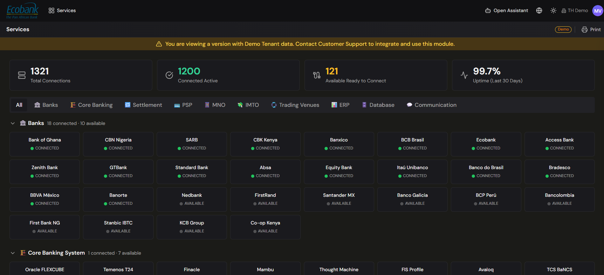

# Integrations — Overview

> **Availability:** `Available` ✅ (the menu is live; individual connectors vary — see each page)
> **Where to find it:** Integrations
> **Who uses it:** treasury operations, finance systems owners, administrators, IT.
> **Permissions required:** administrator to set up and enable connections; see [Roles & Permissions](../00-getting-started/04-roles-and-permissions.md).

## Overview
The **Integrations** menu is where all your data sources connect to Treasury Hub. Instead of logging
into every bank portal, exporting files, and re-keying numbers, you connect a source once and its
data flows in automatically — normalized into the same [financial entities](../00-getting-started/03-core-concepts.md#financial-entities-treasury-hub-understands)
the rest of the platform uses. This is the first layer of the platform: **Sources → Integrations
(ingestion) → Data layer → Workflows → Modules.**

Integrations cover both directions: **inbound** (bringing data *into* Treasury Hub) and **outbound**
(sending data *out* to other systems).

## Key concepts
- **Inbound (ingestion)** — data coming *into* Treasury Hub: bank statements, balances, PSP
  settlements, ERP records, invoices, and files. Most of this menu is about inbound.
- **Outbound** — data Treasury Hub sends *out* to your systems, via exports and outbound APIs. See
  [Data Exports & APIs](../03-data/data-exports.md).
- **Connector** — a single configured link to one source (a bank, an ERP, a PSP, a file feed).
- **Normalization** — no matter which channel a record arrives on, it is converted to Treasury Hub's
  standard model of movements, balances, invoices, and so on, so everything reconciles and reports
  the same way.
- **Active vs Upgrade badges** — inside the menu each item shows a green **Active** badge when it's
  live for your organization, or an orange **Upgrade** badge when it's an add-on you can enable. See
  your administrator.

## What's in the Integrations menu
| Screen | What it's for | Status |
|---|---|---|
| **Services** (catalog) | Browse and connect available connectors, grouped by category. | 🔓 Upgrade |
| [Status](webhooks-and-status.md) | Operational health of each connection (last sync, uptime, logs). | 🔓 Upgrade |
| [Webhooks](webhooks-and-status.md) | Real-time push notifications to/from external systems. | 🔓 Upgrade |
| [Email Ingestion](email-ingestion.md) | Read data from incoming emails and attachments. | ✅ Active |
| [SFTP Ingestion](sftp-ingestion.md) | Pick up files dropped on an SFTP location. | ✅ Active |
| [API Agent Integrator](third-party-apis.md) | Build and maintain third-party API pull integrations with AI help. | 🔓 Upgrade |
| [Ingestion Activity](ingestion-activity.md) | Monitor what's been ingested, with status and errors. | ✅ Active |

## The catalog of sources

The **Services** catalog groups connectors by the kind of system they connect to. Typical categories
include:

- **Banks** — commercial and central banks, for statements and balances.
- **Core banking systems** — e.g. Temenos, Finacle, Flexcube.
- **Settlement networks / payment rails** — e.g. SEPA, PIX, SPEI, ACH, SWIFT.
- **PSPs (payment service providers)** — e.g. Stripe, Mercado Pago, Adyen, dLocal.
- **ERPs** — e.g. [NetSuite](netsuite-erp.md), SAP, Oracle, Dynamics.
- **Files** — [CSV / Excel / PDF import](file-import.md).
- **Email & SFTP** — [Email Ingestion](email-ingestion.md) and [SFTP Ingestion](sftp-ingestion.md).
- **APIs** — [third-party pull APIs](third-party-apis.md) and [inbound push APIs](inbound-apis.md).

> Connector counts and named logos shown in the platform's demo tenant are **examples**. Your
> organization sees the connectors enabled for your plan; ask your account manager to enable more.

## Ways data comes in
Treasury Hub supports several ingestion channels so you can use whatever each source offers:

| Channel | Best for | Page |
|---|---|---|
| SWIFT | Global banks with institutional connectivity. | [SWIFT](swift.md) |
| Open Banking (PSD2) | Local banks, fintechs, neobanks, real-time balances. | [Open Banking](open-banking.md) |
| Third-party APIs (pull) | Vendor systems Treasury Hub reads from on a schedule. | [Third-party APIs](third-party-apis.md) |
| Inbound APIs (push) | Your systems sending data into Treasury Hub. | [Inbound APIs](inbound-apis.md) |
| ERP | NetSuite AP flows and postings, bidirectional. | [NetSuite](netsuite-erp.md) |
| Files | CSV / Excel / PDF, via a templating wizard. | [File import](file-import.md) |
| Email / SFTP | Emails, attachments, and dropped files. | [Email](email-ingestion.md) · [SFTP](sftp-ingestion.md) |

These channels are complementary — for example, [SWIFT](swift.md) and [Open Banking](open-banking.md)
can cover different banks and still land in one unified position.

## Before you start
- Decide which sources you need and which channel each supports (your bank, ERP, or PSP will tell
  you which formats and APIs they offer).
- Confirm you have administrator rights to set up connections — see
  [Roles & Permissions](../00-getting-started/04-roles-and-permissions.md).
- For add-on connectors marked **Upgrade**, contact your account manager to enable them.

## Tips & good practices
- Connect your highest-volume sources first (usually your main banks) so your cash position is
  complete from day one.
- Use [Ingestion Activity](ingestion-activity.md) and the [Status](webhooks-and-status.md) board to
  confirm data is flowing before you rely on downstream reports.
- Where a bank offers both SWIFT and Open Banking, you can use both for resilience.

## Related
- [Core Concepts](../00-getting-started/03-core-concepts.md) — how data flows source → insight.
- [Reconciliation](../04-reconciliation/overview.md) — the main consumer of ingested data.
- [Data Repository](../03-data/data-repository.md) — where ingested inputs are stored with their source.
- [Data Exports & APIs](../03-data/data-exports.md) — the outbound side.
