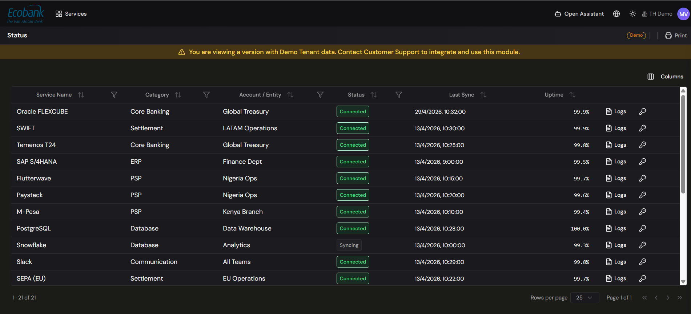

# Webhooks & Integration Status

> **Availability:** `In Preview` 👁️
> **Plan:** Premium (Upgrade) — shown **Upgrade** in the platform.
> **Where to find it:** Integrations › Webhooks · Integrations › Status
> **Who uses it:** finance systems owners, IT, administrators, treasury operations.
> **Permissions required:** administrator to configure; see [Roles & Permissions](../00-getting-started/04-roles-and-permissions.md).

> 👁️ **In Preview.** This module is in testing and available on request — contact Treasury Hub to enable it for your organization. This page describes how it works.

## Overview
Two add-on tools will help you run integrations in real time and keep them healthy:
- **Webhooks** will deliver events the moment they happen — so external systems can react to activity
  in Treasury Hub, and Treasury Hub can receive real-time pushes from other systems.
- **The Integration Status board** will show the operational health of every connection at a glance:
  what's connected, when it last synced, its uptime, and a link to its logs.

Together they will answer two questions: "did that happen yet?" and "is everything still working?"

## Key concepts
- **Webhook** — an automatic notification sent between systems when an event occurs, instead of one
  side repeatedly asking "anything new?". Webhooks can be **inbound** (a system notifies Treasury Hub)
  or **outbound** (Treasury Hub notifies a system).
- **Event** — the thing that triggers a webhook (for example, data received or a status change).
- **Status board** — the list of your connections with a live health indicator for each.
- **Last sync** — when a connection last successfully exchanged data.
- **Uptime** — the proportion of a recent period a connection was healthy.
- **Logs** — the detailed record of a connection's activity, for troubleshooting.

## Before you start
- Confirm these add-ons are enabled (contact your account manager if they show **Upgrade**).
- For webhooks, know which events you want to send or receive and, for outbound webhooks, the
  destination your system exposes.

## How to use it
*The steps below describe the intended experience once this module is live.*

### Set up a webhook
1. Open **Integrations › Webhooks**.
2. Add a webhook and choose whether it is **inbound** (received by Treasury Hub) or **outbound** (sent
   by Treasury Hub).
3. Select the **event(s)** that trigger it and, for outbound, the **destination** and security
   settings.
4. Save and **test** it, then confirm the event was delivered.

### Monitor connection health
1. Open **Integrations › Status**.
2. Review each connection's **status**, **category**, **account/entity**, **last sync**, and
   **uptime**.
3. Sort or filter to find any connection that is degraded or hasn't synced recently.
4. Open a connection's **Logs** to investigate an issue in detail.

## Configuration
- **Webhook events & destinations** — choose which events fire and where they go.
- **Status columns** — adjust the columns shown on the board (for example via **Columns**) to focus
  on what matters to you.

## Tips & good practices
- Check the **Status** board as part of your routine — catching a connection that stopped syncing
  early prevents gaps in your position.
- Use **outbound webhooks** to keep downstream systems in step without them polling Treasury Hub.
- When a connection looks unhealthy, start from its **Logs**, then cross-check
  [Ingestion Activity](ingestion-activity.md) for the affected data.

## Related
- [Integrations Overview](overview.md) — all connectors and channels.
- [Ingestion Activity](ingestion-activity.md) — item-level view of what was ingested.
- [Inbound APIs](inbound-apis.md) and [Third-party APIs](third-party-apis.md) — the integrations these tools monitor.
- [Alerts](../08-alerts/alerts.md) — where integration failures also surface.
