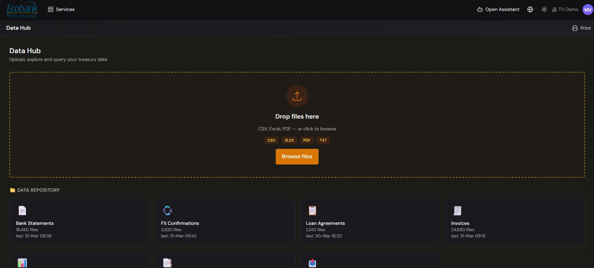

# Data Hub

> **Availability:** `Available` ✅ (shown **Active** in the platform)
> **Where to find it:** Data › Data Hub
> **Who uses it:** treasury operations, finance teams, data/IT owners.
> **Permissions required:** Data access (see [Roles & Permissions](../00-getting-started/04-roles-and-permissions.md)).

## Overview
The Data Hub is the landing screen for the **Data** module — the place to **upload, explore and query
your treasury data**. It brings together two things: a **file upload** zone for data that doesn't
come through an automatic feed, and a browsable **Data Repository** of everything that's been
ingested, grouped by category.

Most of your data arrives automatically through [Integrations](../02-integrations/overview.md). The
Data Hub complements that by giving you a place to drop files that *don't* come through an automatic
feed, and to look across everything the platform has stored — regardless of how it got there.

## Key concepts
- **Normalized data** — raw files from banks, ERPs, and other sources are cleaned and converted into
  a consistent internal format so every module works from the same, comparable data. See
  [Core Concepts](../00-getting-started/03-core-concepts.md#data-flows-in-one-direction-source-insight).
- **Category** — a type of stored data (for example Bank Statements, FX Confirmations, Invoices).
  The **Data Repository** groups files into category cards, each showing a file count and when it was
  last updated.
- **Manual upload** — files you add yourself by dragging them into the drop zone or browsing, rather
  than receiving them through an automatic integration.

## Before you start
- Your data sources should be connected so that automatic feeds populate the repository — see
  [Integrations](../02-integrations/overview.md).
- To upload files manually, have them ready in a supported format (see below).
- Confirm your team's [permissions](../00-getting-started/04-roles-and-permissions.md) for the Data
  module.

## How to use it

### Upload a file manually
1. Open **Data › Data Hub**.
2. Drag one or more files into the **drop-files** zone at the top of the screen, or click
   **Browse files** to pick them from your computer.
3. Supported formats are **CSV, XLSX, PDF, and TXT**.
4. Treasury Hub ingests the file and adds it to the matching category in the repository. Once
   processing finishes, the file appears in the [Data Repository](data-repository.md).

### See what data you already have
1. On the Data Hub, look at the **Data Repository** section — a set of category cards.
2. Each card shows a data **category**, the number of files stored, and when it was last updated —
   for example Bank Statements, FX Confirmations, Loan Agreements, and Invoices.
3. Click a card to open the full [Data Repository](data-repository.md) filtered to that category,
   where you can search, sort, and download individual files.

### Print
1. Click **Print** to prepare the current view for printing.

## Tips & good practices
- Reserve **manual upload** for data that doesn't have an automatic feed yet; wherever possible,
  connect the source through [Integrations](../02-integrations/overview.md) so files arrive and stay
  current on their own.
- Use the **Data Repository** cards to see at a glance which categories are up to date and which have
  gone stale.
- When you need a formatted, shareable output, build it in the Reporting module rather than the
  Data Hub.

## Related
- [Data Repository](data-repository.md) — browse, search, and download stored files.
- [Data Exports](data-exports.md) — send Treasury Hub data out to your own systems via API.
- [Integrations](../02-integrations/overview.md) — where most of your data comes from automatically.
- [Core Concepts](../00-getting-started/03-core-concepts.md) — normalized data and how it flows.

## In Preview
- 👁️ **Oliver — Data Governance & Lineage agent.** A plain-language assistant that would query your
  data, check data quality, trace where a record came from (**lineage**), and help you find and
  download files. Oliver is in preview and is **not** a visible chat panel in the Data Hub today.
  Its rollout and exact scope should be confirmed with the Treasury Hub team — see
  your administrator.
