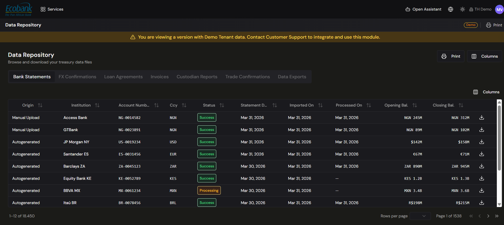

# Data Repository

> **Availability:** `In Preview` 👁️
> **Plan:** Premium (Upgrade) — shown **Upgrade** in the platform.
> **Where to find it:** Data › Data Repository
> **Who uses it:** treasury operations, finance teams, auditors, data/IT owners.
> **Permissions required:** Data access (see [Roles & Permissions](../00-getting-started/04-roles-and-permissions.md)).

> 👁️ **In Preview.** The Data Repository is in testing and available on request. To browse
> and download stored data today, use the [Data Hub](data-hub.md). This page describes what the
> Repository *will* add.

## Overview
The Data Repository is where you browse, search, and download every file Treasury Hub has stored —
whether it arrived through an automatic integration or was uploaded manually. Files are organized by
**category** (Bank Statements, FX Confirmations, Invoices, and more), so you can quickly find a
specific document, review its processing status, or pull the original file for audit or reference.

Think of it as the searchable filing cabinet behind the platform: everything ingested is kept here,
queryable, and traceable back to its source.

## Key concepts
- **Category** — the type of data a file belongs to. Categories appear as tabs across the top; each
  holds a different kind of document (e.g. Bank Statements, FX Confirmations, Loan Agreements,
  Invoices, Custodian Reports, Trade Confirmations, Data Exports).
- **Origin** — how a file got into Treasury Hub: **Manual Upload** (you added it) or
  **Autogenerated** (it arrived through an integration or was produced by the platform).
- **Status** — where a file is in the ingestion pipeline: **Success** (processed and available),
  **Processing** (still being handled), or **Failed** (needs attention).
- **Original file** — the source document exactly as it was received; you can download it from any
  row.

## Before you start
- Data must already be in the platform. Most files arrive automatically through
  [Integrations](../02-integrations/overview.md); you can also add files from the
  [Data Hub](data-hub.md) using **Manual Upload**.
- Confirm your [permissions](../00-getting-started/04-roles-and-permissions.md) for the Data module.

## How to use it

### Browse files by category
1. Open **Data › Data Repository**.
2. Select a **category tab** at the top of the screen (for example **Bank Statements**).
3. The grid lists the files in that category. For bank statements, columns include **Origin,
   Institution, Account Number, Currency (Ccy), Status, Statement Date, Imported On, Processed On,
   Opening Balance,** and **Closing Balance**.
4. Use the pagination controls at the bottom to move through large result sets.

### Find a specific file
1. Sort any column by clicking its header (for example, sort by **Statement Date** to see the most
   recent first).
2. Use the column filters to narrow the list — for example by institution, currency, date range, or
   status.
3. Click **Columns** to show or hide fields. Beyond the default view, additional columns are
   available, including **Account Name, Account Owner, Company, File Name, File Format, Statement #,
   Serial #, credit/debit counts and amounts,** and **Created / Updated By**.

### Download an original file
1. Locate the file's row in the grid.
2. Click the **download** icon (⬇) at the end of the row.
3. The original file is downloaded to your computer, exactly as it was received.

### Ask Oliver about the repository
1. Open the **Oliver** panel on the right of the screen.
2. Oliver is aware of the category you're viewing, so you can ask context-specific questions — for
   example, "Show me all statements with an opening balance over *[amount]*," or ask it to summarize
   balances across accounts or trace a file's **lineage** back to source.
3. Oliver can also filter the current view and help you **bulk download** the filtered results.

## Tips & good practices
- Check the **Status** column when troubleshooting missing data — a file stuck in **Processing** or
  marked **Failed** explains why records aren't showing up elsewhere.
- Use **Columns** to tailor the grid to what you're investigating (for example, add **File Name** and
  **Created By** when tracking down who uploaded what).
- Keep the original files as your audit source of truth — the download icon always gives you the
  document as received, unchanged.
- For questions that span many files, let **Oliver** filter and summarize rather than paging through
  the grid manually.

## Related
- [Data Hub](data-hub.md) — the Data module landing page, manual upload, and category overview.
- [Data Exports](data-exports.md) — push this stored data out to your own systems via API.
- [Integrations](../02-integrations/overview.md) — the automatic feeds that populate the repository.
- [Reconciliation](../04-reconciliation/overview.md) — where the normalized data is matched.
- [Core Concepts](../00-getting-started/03-core-concepts.md) — the financial entities Treasury Hub
  stores.

## In Preview
- The rollout and exact scope of the **Oliver** data agent should be confirmed with the Treasury Hub
  team — see your administrator.
