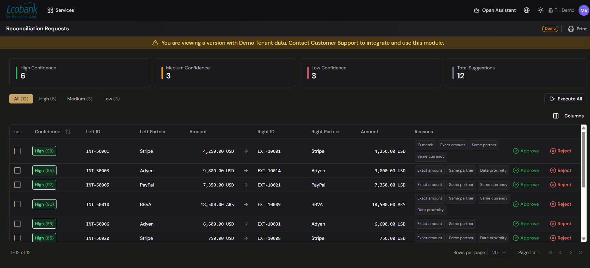

# Reconciliation — Reconciliation Approvals

> **Availability:** `In Preview` 👁️
> **Where to find it:** Reconciliation › Reconciliation Approvals (the screen it opens is titled **Reconciliation Requests**)
> **Who uses it:** finance team, reconciliation reviewers and approvers.
> **Permissions required:** reconciliation access · CreateEdit to approve or reject; Read to view (see [Roles & Permissions](../00-getting-started/04-roles-and-permissions.md)).

> 👁️ **In Preview.** The Reconciliation module is in testing and available on request — contact Treasury Hub to enable it. This page describes how it works.

## Overview
**Reconciliation Requests** is the queue of machine-suggested matches waiting for a human decision.
The platform proposes each pairing with a **confidence** score and the **reasons** it matched, and
you approve or reject — one at a time, a selected group, or all at once with **Execute All**.
Approving a request creates the reconciliation; rejecting it clears the suggestion. This is where the
AI-assisted matching surfaces for review; hand-picked matches are made on the
[Matching](matching.md) screen instead.

## Key concepts
- **Suggested match (request)** — a candidate pairing the engine proposes, with a confidence score
  and reasons, awaiting your decision.
- **Confidence** — how sure the engine is about a suggestion, banded **High**, **Medium**, or
  **Low** (and shown as a score, e.g. High 98). High suggestions are safe to accept quickly; Low ones
  deserve a careful look.
- **Reasons** — the plain-language chips explaining why the two items were paired: **ID match**,
  **Exact amount**, **Same partner**, **Same currency**, **Date proximity**. More reasons generally
  means a stronger match.
- **Approve** — accept the suggestion; the platform creates the corresponding reconciliation.
- **Reject** — decline the suggestion; it's removed from the queue.
- **Execute All** — approve every suggestion currently in view in one action.

## Before you start
- You need reconciliation access at **CreateEdit** level to approve or reject.
- Your matching [rules & criteria](rules-and-criteria.md) drive how many suggestions — and at what
  confidence — reach this queue.

## How to use it

### Read the queue
1. Open **Reconciliation › Reconciliation Approvals** (the screen is titled **Reconciliation Requests**).
2. The tiles at the top count suggestions by confidence — **High**, **Medium**, **Low** — plus
   **Total Suggestions**. Use the tabs (**All**, **High**, **Medium**, **Low**) to focus on one band.
3. Each row shows a **select** checkbox, the **Confidence** score, the **Left** item (ID, Partner,
   Amount), an arrow, the **Right** item (ID, Partner, Amount), and the **Reasons** chips.
4. Use **Columns** to choose which columns are visible in the grid.

### Approve or reject a single suggestion
1. Find the suggestion in the grid (filter by confidence tab if it helps).
2. Read the **Reasons** chips and check the amounts on both sides.
3. Click **Approve** to create the reconciliation, or **Reject** to discard the suggestion. The row
   leaves the queue either way.

### Act on many at once
1. Tick the **select** checkbox on each suggestion you want to act on, or use the header checkbox to
   select every suggestion in the current view.
2. Approve or reject the selected rows together, or — to approve the whole current view without
   selecting rows individually — click **Execute All**.
3. Confirm. The queue refreshes and the tiles recount.

> **Tip:** switch to the **High** tab and use **Execute All** to clear high-confidence suggestions in
> one pass, then work **Medium** and **Low** row by row.

> The confidence scores, partners, and amounts shown in the platform are your own live data; any
> figures in this help center are illustrative examples.

## Tips & good practices
- Work **High-confidence** suggestions first — they clear the backlog quickly and safely.
- Read the **Reasons** chips on **Low**-confidence rows before approving; an ID or exact-amount match
  is stronger evidence than date proximity alone.
- Use **Execute All** only when you've filtered to a band you trust; otherwise select rows
  deliberately.
- Every approval trains the engine, so the queue tends to shrink as your rules and history mature.

## Related
- [Reconciliation Overview](overview.md) — where suggested matches sit in the end-to-end flow.
- [Matching](matching.md) — make hand-picked 1-to-1 or batch matches instead of working suggestions.
- [Rules & Criteria](rules-and-criteria.md) — tune what reaches this queue and at what confidence.
- [ERP Posting](erp-posting.md) — reconciled items can then be prepared for posting.
- [Alerts](../08-alerts/alerts.md) — requests flagged by rules or anomalies surface here too.
