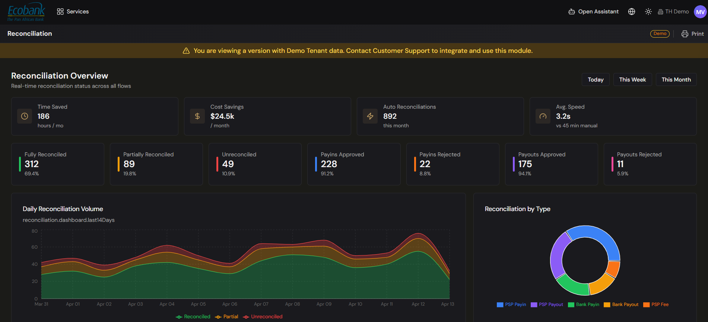

# Reconciliation — Dashboard

> **Availability:** `In Preview` 👁️
> **Where to find it:** Reconciliation › Dashboard
> **Who uses it:** treasury operations, finance team, accountants.
> **Permissions required:** reconciliation access · Read (see [Roles & Permissions](../00-getting-started/04-roles-and-permissions.md)).

> 👁️ **In Preview.** The Reconciliation module is in testing and available on request — contact Treasury Hub to enable it. This page describes how it works.

## Overview
The Dashboard is the command view of the Reconciliation module. It shows, for a period you
choose, how much of your financial data is matched, what still needs attention, and how much time
and cost auto-matching has saved you. Use it to monitor the health of reconciliation at a glance
before drilling into the detail screens.

## Key concepts
- **Reconciliation status** — every item and flow is **Fully Reconciled**, **Partially
  Reconciled**, or **Unreconciled**. See [Core Concepts](../00-getting-started/03-core-concepts.md)
  and the [Reconciliation Overview](overview.md).
- **Payin / payout exception** — an approved payin or payout that hasn't appeared in the PSP or bank
  yet (or the reverse: rejected internally but paid at the PSP/bank). These are the items most
  likely to need manual follow-up.
- **Savings** — the estimated time and cost avoided by letting the engine and Sophia (AI) match
  items automatically instead of doing it by hand.

## How to use it

### Choose the reporting period
1. Open **Reconciliation › Dashboard**.
2. In the top-right **period selector**, choose **Today**, **This Week**, or **This Month**.
3. The **range hint** below the title (for example, "Showing data for: Feb 9 – Feb 15") confirms the
   dates. All tiles and charts update to that window.

### Read the status KPIs
The top row shows one tile per status, each with a count, a percentage of the total, and the total
amount:
- **Fully Reconciled** (green) — matched end to end.
- **Partially Reconciled** (amber) — some, but not all, steps matched.
- **Unreconciled** (red) — nothing matched yet.

Four exception tiles sit alongside them:
- **Payins Approved, Not in PSP/Bank** and **Payouts Approved, Not in PSP/Bank** — expected money
  that hasn't landed.
- **Payins Rejected, Paid in PSP/Bank** and **Payouts Rejected, Paid in PSP/Bank** — money that
  moved despite an internal rejection.

Each tile is colour-coded by severity. Use them as your daily worklist: high exception counts point
you to the [Matching](matching.md), [Approvals](approvals.md), and [Alerts](../08-alerts/alerts.md)
screens.

### Read the savings tiles
The dark band shows the impact of automation for the selected period:
- **Time Saved** — hours saved this period.
- **Cost Savings** — estimated cost avoided.
- **Auto Reconciliations** — manual steps the engine handled for you.
- **Avg Speed** — average time to reconcile an item versus doing it manually.

### Read the charts
- **Daily Reconciliation Volume** — an area chart of the last 14 days, split into bank movements,
  PSP items, and errors, so you can spot spikes or a rising error trend.
- **Reconciliation by Type** — a donut breaking volume down by item type (for example Payin PSP,
  Payin Bank, Payout PSP, Payout Bank, Fee PSP), with a legend underneath.

> The numbers, counterparties, and currencies shown in the platform are your own live data. Any
> figures used in this help center are illustrative examples.

## Tips & good practices
- Check the **exception tiles** first thing each day — they surface the items most at risk of a
  break.
- Watch the **error series** in the volume chart; a rising trend usually signals a data or
  integration issue upstream (see [Integrations](../02-integrations/overview.md)).
- Compare the **auto-match rate** (Fully Reconciled % plus Auto Reconciliations) across periods to
  see whether your rules and Sophia's suggestions are improving.

## Related
- [Reconciliation Overview](overview.md) — how the whole module fits together.
- [Movements & Flows](movements-and-flows.md) — drill into the underlying items.
- [Matching](matching.md) and [Approvals](approvals.md) — clear the exceptions the KPIs surface.
- [Alerts](../08-alerts/alerts.md) — reconciliation anomalies and rule alerts.
