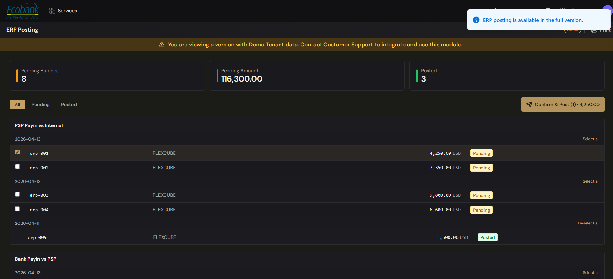

# Reconciliation — ERP Posting

> **Availability:** `In Preview` 👁️
> **Where to find it:** Reconciliation › ERP Posting
> **Who uses it:** finance team, accountants.
> **Permissions required:** reconciliation access · CreateEdit to confirm postings (see [Roles & Permissions](../00-getting-started/04-roles-and-permissions.md)).

> 👁️ **In Preview.** The Reconciliation module is in testing and available on request — contact Treasury Hub to enable it. This page describes how it works.

## Overview
ERP Posting is where you prepare your confirmed reconciliations for your accounting system. Confirmed
reconciliations are grouped into **batches** by **conciliation rule** and **date**, and you review and
**Confirm & Post** the batches you're ready to send. Each row on the screen is a **batch** (not
necessarily a single reconciliation — see below). The actual delivery of those postings into your ERP
additionally requires the **ERP-integration add-on** — see the note below.

> **The push to your ERP needs the ERP-integration add-on.** You build, review, and confirm posting
> batches on this screen. Delivering them into your accounting system
> (e.g. FLEXCUBE, NetSuite, SAP) is part of the ERP-integration add-on. Until it's enabled for your
> tenant, the platform indicates that **"ERP posting is available in the full version."** Contact the
> Treasury Hub team to enable it.

## Key concepts
- **Batch** — the unit you post: **one row = one batch**, identified by an ID (e.g. `ERP-0081`) and
  grouped by **conciliation rule** and **date**. A batch's row shows how many reconciled **items** it
  contains.
- **Batch type (SINGLE vs BATCH)** — follows the conciliation rule behind it:
  - **SINGLE** — the batch holds **one** reconciled flow (so the row *is* a single reconciliation, "1 item").
  - **BATCH** — the batch **groups several** reconciled flows (from the same rule and date) into one posting.
- **Target ERP** — the accounting system each batch is destined for (for example FLEXCUBE, NetSuite,
  SAP), connected through the [ERP Integration](../11-accounting/erp-integration.md) add-on.
- **Posting status** — a batch is **Pending** (prepared, not yet posted) or **Posted**.
- **Confirm & Post** — the action that finalizes the selected batches for delivery to your ERP. It's
  **irreversible**, which is why posting is done per batch with explicit selection.

## Before you start
- The items you want to post must already be reconciled (and approved, where your process requires
  it — see [Reconciliation Requests](approvals.md)).
- You need reconciliation access at **CreateEdit** level to confirm postings.
- To actually deliver postings to your accounting system, your tenant needs the ERP-integration
  add-on — see [ERP Integration](../11-accounting/erp-integration.md).

## How to use it

### Review what's pending
1. Open **Reconciliation › ERP Posting**.
2. The tiles at the top show **Pending Batches**, **Pending Amount**, and **Posted**.
3. Use the tabs (**All**, **Pending**, **Posted**) to switch between states.
4. Batches are grouped by **conciliation rule and date** (for example "PSP Payin vs Internal"). Expand a
   group to see its individual batch rows (`ERP-0081` …), each with its **type** (SINGLE/BATCH), **items**
   count, **target ERP**, **amount**, and
   **Pending / Posted** status.

### Prepare and confirm a posting batch
1. Expand the group you're working on.
2. Tick the batch(es) you want to post, or use **Select all** / **Deselect all** to act on the whole
   group.
3. Review the sticky footer button, which shows the count and total — **Confirm & Post (n) ·
   amount**.
4. Click **Confirm & Post**. On a tenant with the ERP-integration add-on, the selected batches are
   delivered to your accounting system and move to **Posted**. Without the add-on, the platform shows
   **"ERP posting is available in the full version."**

> The target ERP, amounts, and partners shown in the platform are your own live data; any figures in
> this help center are illustrative examples.

## The posting trail
Because batches are grouped by match type and date, every posted amount can be traced back to the
exact reconciliations behind it. Switch to the **Posted** tab to see what has already been sent, and
follow the resulting entries in [Accounting / G/L Postings](../11-accounting/gl-postings.md).

## Tips & good practices
- **Double-check the selection and total** in the footer before you confirm.
- Post in **match-type / date batches** rather than ad hoc, so your ledger entries line up with your
  reconciliation groups.
- Reconcile and approve first; only fully settled items should reach ERP Posting.
- If delivery is blocked with "available in the full version," your tenant doesn't yet have the
  ERP-integration add-on — contact the Treasury Hub team.

## Related
- [Reconciliation Overview](overview.md) — the last step of the end-to-end flow.
- [Reconciliation Requests (Approvals)](approvals.md) — where reconciliations are signed off before posting.
- [Accounting / G/L Postings](../11-accounting/gl-postings.md) — the ledger entries posting creates.
- [ERP Integration](../11-accounting/erp-integration.md) — the add-on that connects Treasury Hub to your ERP.

## In Preview
- 👁️ **ERP delivery (ERP-integration add-on)** — pushing confirmed posting batches into your
  accounting system (FLEXCUBE, NetSuite, SAP, and others). Preparing and confirming batches is
  available now; delivery is enabled with the add-on.
