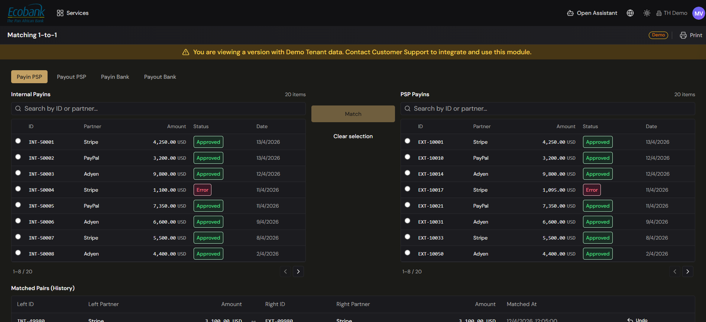

# Reconciliation — Matching (1-to-1 & Batch)

> **Availability:** `In Preview` 👁️
> **Where to find it:** Reconciliation › Matching (1-to-1) · Recon Batch
> **Who uses it:** treasury operations, finance team, accountants.
> **Permissions required:** reconciliation access · CreateEdit to confirm matches; Read to review (see [Roles & Permissions](../00-getting-started/04-roles-and-permissions.md)).

> 👁️ **In Preview.** The Reconciliation module is in testing and available on request — contact Treasury Hub to enable it. This page describes how it works.

## Overview
Matching is where you resolve, by hand, the items your rules didn't reconcile automatically. You
pick one item on each side and pair them (**1-to-1**), and — for a bank settlement that groups
several movements — you match many items to many at once (**batch**). This screen is deliberately
manual: you choose the two sides and confirm. Machine-suggested matches (with a confidence score and
reasons) live on a separate screen — see [Reconciliation Requests](approvals.md).

## Key concepts
- **Match** — the link between two or more items the system treats as the same real-world event.
  Matches can be **1-to-1** or **batch** (many-to-many).
- **Internal vs PSP/Bank** — the two panels on the 1-to-1 screen. The left panel holds your
  **internal** records; the right panel holds the counterpart records from the **PSP** or the
  **bank**, depending on the tab you're on.
- **Matched Pairs (History)** — the running list of pairs you've matched on this screen, each of
  which you can reverse with **Undo**.
- **Suggested match** — a candidate pairing proposed by the platform, with a confidence level and
  reasons. Suggestions do **not** appear here; you review and act on them in
  [Reconciliation Requests](approvals.md).

## Before you start
- Confirm your matching [rules & criteria](rules-and-criteria.md) are set up so the engine handles
  the routine items automatically and only the exceptions reach this screen.
- Make sure the relevant data sources are connected — see [Integrations](../02-integrations/overview.md).

## How to use it

### Match two items 1-to-1 (manual)
1. Open **Reconciliation › Matching** (the 1-to-1 matching screen).
2. Choose the pairing you're working on from the tabs: **Payin PSP**, **Payout PSP**, **Payin
   Bank**, or **Payout Bank**.
3. The screen shows **two panels** side by side — **Internal** on the left and **PSP** (or **Bank**)
   on the right. Each panel has a **search box** and a list of checkbox rows showing **ID, Partner,
   Amount, Status, Date**. Use search to narrow each side.
4. Tick **one** row on the left and **one** row on the right.
5. Click **Match** (in the center). The two rows are paired and drop off the unmatched lists.
6. To start over before matching, click **Clear selection** to deselect both sides.

There are no AI confidence scores or suggested pairings on this screen — you decide each pair. To
work from machine-suggested matches instead, use [Reconciliation Requests](approvals.md).

### Review and undo matched pairs
1. Open the **Matched Pairs (History)** list on the same screen. It shows the pairs you've matched
   here, most recent first.
2. To reverse a pair, click **Undo** on its row. The two items return to their unmatched lists so you
   can re-match them correctly.

### Match in batch (many-to-many)
1. Open **Reconciliation › Recon Batch**.
2. This screen pairs several items on one side with several on the other — for example one bank
   settlement that covers multiple PSP movements.
3. Select the bank movement(s) on one side and tick the PSP movements and fees on the other.
4. A **summary** totals each side and shows the **difference** live as you select, so you can see
   when the two sides balance.
5. When the difference is zero (or within tolerance), confirm to match the whole set at once.

> Counterparties, amounts, and dates shown in the platform are your own live data; any figures in
> this help center are illustrative examples.

## Tips & good practices
- Use each panel's **search** to line up the ID, partner, or amount you're matching before you tick
  a row — it's faster than scrolling.
- If you pair the wrong two items, don't worry: **Undo** from **Matched Pairs (History)** puts them
  back on the unmatched lists.
- For a bank settlement that groups many PSP items, use **batch** rather than several 1-to-1 matches.
- To clear a backlog quickly from machine suggestions, work the
  [Reconciliation Requests](approvals.md) queue first, then match the remaining exceptions here.

## Related
- [Reconciliation Overview](overview.md) — how matching fits the end-to-end flow.
- [Reconciliation Requests (Approvals)](approvals.md) — review and approve machine-suggested matches with confidence and reasons.
- [Rules & Criteria](rules-and-criteria.md) — reduce what reaches this screen by tuning your rules.
- [Movements & Flows](movements-and-flows.md) — see the items you're matching in context.
- [Alerts](../08-alerts/alerts.md) — anomalies and rule alerts the platform raises.
