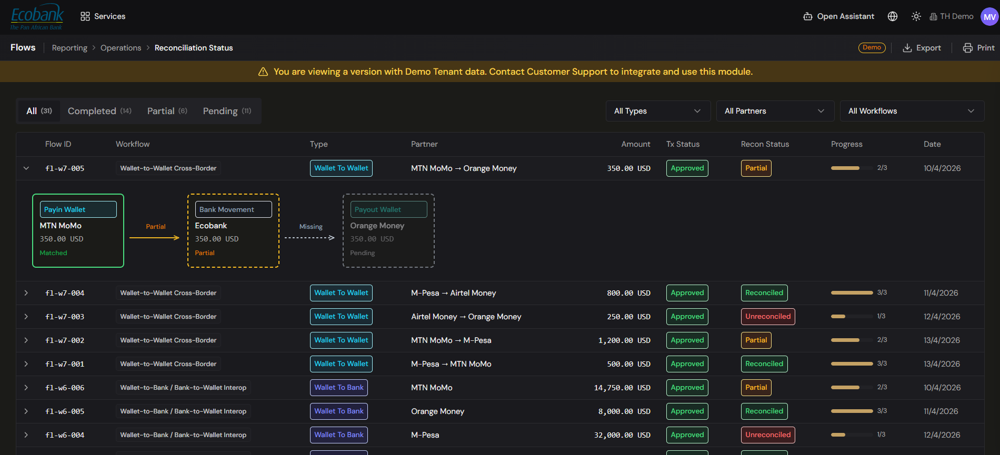

# Reconciliation — Flows

> **Availability:** `In Preview` 👁️
> **Where to find it:** Reconciliation › **Reconciliation Status** (also reachable as the **Reconciliation Status** report under **Reporting › Operations**). The screen lists your **flows**.
> **Who uses it:** treasury operations, finance team, accountants.
> **Permissions required:** reconciliation access · Read (see [Roles & Permissions](../00-getting-started/04-roles-and-permissions.md)).

> 👁️ **In Preview.** The Reconciliation module is in testing and available on request — contact Treasury Hub to enable it. This page describes how it works.

## Overview
The **Reconciliation Status** screen lists your reconciliation **flows** — each row is a flow,
identified by a **Flow ID**. A flow is a chain of related **movements** (the individual financial
items) that belong to one real-world transaction, so you can follow money from end to end and see
exactly where a break is. The individual movements aren't a separate top-level list here — they are
the **steps inside a flow**, which you see by expanding it.

> Looking for a flat list of individual items rather than flows? Use
> [Transactions](../06-reporting/transactions.md) under Reporting › Operations.

## Key concepts
- **Flow** — a chain of related movements that belong together, for example **Payout Internal →
  Payout PSP → Bank Movement**. A flow is *fully reconciled* only when every step in the chain is
  matched. Each flow has a **Flow ID**.
- **Movement** — a single financial item (a bank movement, a payin/payout, a PSP settlement, a fee).
  Movements are the **steps** that make up a flow.
- **Progress** — how many steps of a flow are matched (for example 2/3). See
  [Reconciliation statuses](overview.md#reconciliation-statuses).
- **Source** — where a movement came from: Bank, PSP, internal records, and so on. See
  [Integrations](../02-integrations/overview.md).

## How to use it

### Browse flows
1. Open **Reconciliation › Reconciliation Status**.
2. Use the tabs to filter by flow state — for example **All**, **Completed**, **Incomplete**, and
   **Pending**.
3. Use the filters (Type, Partner, Workflow) to narrow the list.
4. Each row shows the **Flow ID**, type, partner, amount, transaction status, reconciliation status, a
   **progress** bar (matched steps out of total), and the date.

### See the movements inside a flow
1. Click a flow row to **expand** it.
2. The flow chain renders horizontally — **one card per movement/step** (for example **Payout Internal
   → Payout PSP → Bank Movement**), with a **Matched** link between connected steps.
3. Each card shows that movement's amount, partner, and status, so you can see exactly which step is
   complete and which is still open.

> Counterparties, amounts, and currencies shown in the platform are your own data; any figures in this
> help center are illustrative examples.

## Tips & good practices
- Use the **progress bar** to spot the exact step that failed, rather than scanning individual items.
- An **incomplete** flow with a predicted-but-missing step usually means expected money hasn't landed
  yet — cross-check the exception tiles on the [Dashboard](dashboard.md).
- For a specific individual item (by reference or amount), find it in
  [Transactions](../06-reporting/transactions.md), then trace it into its flow here.

## Related
- [Reconciliation Overview](overview.md) — flows, movements, statuses, and how matching works.
- [Matching](matching.md) — pair up unmatched items.
- [Dashboard](dashboard.md) — status and exception summary.
- [Transactions](../06-reporting/transactions.md) — the flat list of individual items.
- [Workflows](workflows.md) — how flow chains are defined.
