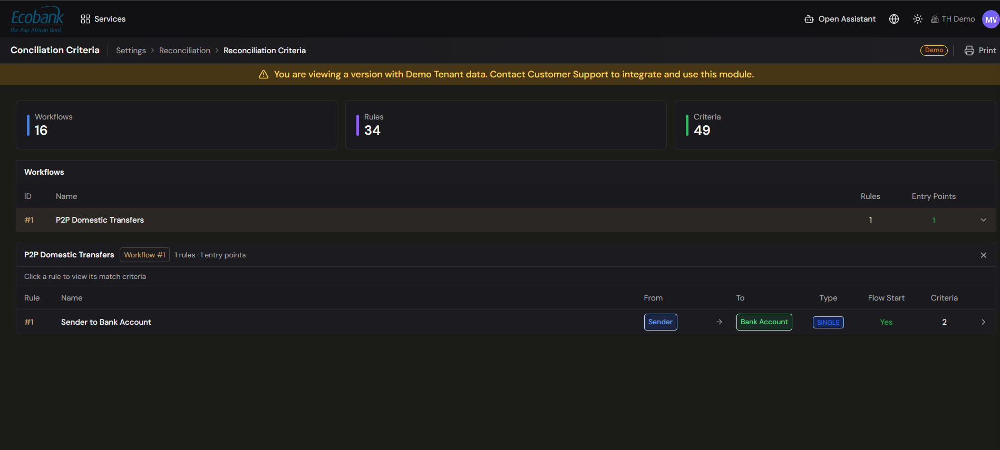

# Reconciliation — Rules & Criteria

> **Availability:** `In Preview` 👁️
> **Where to find it:** basic rules under **Admin Console › Matching Rules**; the advanced criteria/chain builder under **Configuración › Reconciliation Criteria (Criterios de Conciliación)**.
> **Who uses it:** treasury operations lead, reconciliation administrators.
> **Permissions required:** reconciliation matching rules · CreateEdit to create or edit; Read to view (see [Roles & Permissions](../00-getting-started/04-roles-and-permissions.md)).

> **Two related but distinct things — mind the difference:**
> - **Matching Rules (basic)** — `Available` ✅. Live, tenant-wide rules that auto-categorize, tag,
>   and route transactions, managed under **Admin Console › Matching Rules (Reglas de Coincidencia)**.
>   See [Admin — Matching Rules](../10-admin-console/matching-rules.md).
> - **Reconciliation Criteria builder (advanced)** — `In Preview` 👁️. The advanced criteria-and-chain
>   builder described below — **Configuración › Reconciliation Criteria (Criterios de Conciliación)** —
>   is in testing and available on request. The steps in this page describe what it *will* do.

## Overview
Reconciliation rules are the conditions that make items match automatically. In the advanced builder you
will define the criteria a match must meet — amount, tolerance, reference, date window, partner,
currency — and organise rules into ordered **chains** that the engine applies in sequence. Good rules
mean most items reconcile with no manual effort, leaving only genuine exceptions for the
[Matching](matching.md) screen.

## Key concepts
- **Reconciliation rule (criteria)** — the conditions two items must satisfy to be matched. A rule
  states which item types it links (a **From** type and a **To** type), whether it matches items one
  at a time (**Single**) or in groups (**Batch**), and one or more match criteria.
- **Criterion** — a single condition, such as *amount equals*, *amount within a tolerance*, *same
  reference*, *value date within ± N days*, *same partner*, or *same currency*.
- **Filter** — an optional condition that narrows which movements a rule even considers, before the
  match criteria are applied.
- **Rule chain** — an ordered sequence of rules the engine runs top to bottom; the first rule that
  matches wins. Every rule belongs to one chain.
- **Flow start** — marks the rule that begins a flow chain (see [Movements & Flows](movements-and-flows.md)).

## Before you start
- Rules live under a **workflow**. Set up (or pick) the workflow first — see
  [Workflows](workflows.md).
- Decide the item types you're matching (for example Payin Internal to Payin PSP) and the tolerance
  your business accepts.

## How to use it
*The steps below describe the advanced Reconciliation Criteria builder (Configuración › Criterios de
Conciliación), which is `In Preview` 👁️. Basic Matching Rules that are live today are managed in
[Admin Console › Matching Rules](../10-admin-console/matching-rules.md).*

### Create a rule
1. Open **Reconciliation › Conciliation Criteria** and select the workflow whose rules you want to
   manage, then choose **New rule**.
2. Set the **basics**: the **From** and **To** movement types, the **conciliation type** (**Single**
   or **Batch**), whether it's a **flow start**, and the **chain** it belongs to.
3. Add one or more **match criteria**. For each, pick the field to compare and the operator:
   - **Equals** — the values must match exactly (for example amount, reference, currency, partner).
   - **Range / tolerance** — the values must fall within an allowed difference (for example amount
     within a percentage, or value date within ± N days).
   - **Sum equals** — the totals of both sides must balance (used for batch matches).
4. Optionally add **filters** to restrict which movements the rule applies to before matching.
5. Set what the engine should do for each outcome (for example auto-reconcile a unique match, raise
   an alert, or fall through to the next rule).
6. Save. The rule joins its chain and starts matching new movements straight away.

### Edit or deactivate a rule
1. Select a rule to open its detail, then choose **Edit** to change any of its criteria, filters, or
   actions.
2. To stop a rule matching new items without deleting it, choose **Deactivate**. Existing matches and
   alerts are kept; the rule simply stops running. (Rules are deactivated rather than hard-deleted so
   your configuration history stays intact.)

### Organise rules into chains
1. From a workflow, open its **rule chains**.
2. Create a chain with a **name** and the number of **required steps** that make it complete, then
   assign rules to it. A new chain starts inactive until it has at least one rule.
3. Rules run in the chain's order; reorder or **move a rule to another chain** to change how the
   engine sequences them.
4. If a chain's steps don't yet form a valid sequence, it's flagged as **degraded** with a short
   explanation — open it, review the listed rules, and adjust them until the chain is valid.

## Configuration
- **Operators available:** Equals, Range/tolerance, Sum equals.
- **Common criteria fields:** amount, reference, value date, partner, currency, personal/tax ID.
- **Conciliation type:** Single (item-to-item) or Batch (group-to-group).
- **Rule outcomes:** auto-reconcile, raise an alert, or pass to the next rule in the chain.

## Tips & good practices
- Start from the **built-in workflows** and their rules, then tighten criteria as real exceptions
  appear.
- Put the **strictest, highest-confidence** rules first in a chain and looser tolerance rules later,
  so exact matches win before approximate ones.
- Keep tolerances realistic: too tight and good items fall through to manual matching; too loose and
  the engine mis-matches.
- Prefer **Deactivate** over deleting — it preserves the audit trail.

## Related
- [Reconciliation Overview](overview.md) — rules, chains, and the matching engine.
- [Matching](matching.md) — where items your rules didn't catch are resolved.
- [Workflows](workflows.md) — rules and chains live inside workflows.
- [Admin — Matching Rules](../10-admin-console/matching-rules.md) — the tenant-wide matching rules
  used across the platform (distinct from reconciliation criteria).
