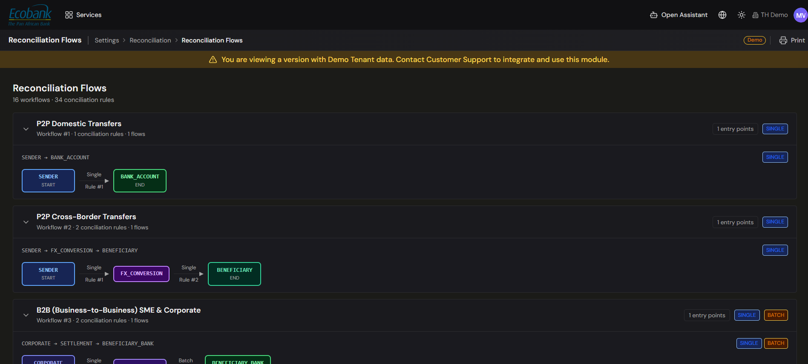

# Reconciliation — Workflows

> **Availability:** `In Preview` 👁️
> **Where to find it:** Settings › Reconciliation › **Reconciliation Flows (Flujos de Conciliación)** — there is no "Reconciliation › Workflows" menu item. (The flows it produces are viewed under [Flows (Reconciliation Status)](movements-and-flows.md).)
> **Who uses it:** treasury operations lead, reconciliation administrators.
> **Permissions required:** reconciliation workflows · CreateEdit to create or edit; Read to view (see [Roles & Permissions](../00-getting-started/04-roles-and-permissions.md)).

> 👁️ **In Preview.** This is in testing and available on request — contact Treasury Hub to enable it. This page describes how it works.

## Overview
A reconciliation **workflow** defines a type of end-to-end matching — which item types chain
together and in what order — and holds the [rules](rules-and-criteria.md) that drive it. Treasury Hub
will ship with ready-to-use workflows for the most common patterns, and you will be able to add your
own for treasury-specific flows. This screen will be where you view, create, edit, and deactivate them.

## Key concepts
- **Workflow** — a named configuration that describes a matching pattern (its chain of item types)
  and groups the rules that reconcile it.
- **Step / chain** — the ordered stages of a workflow, for example **Payin Internal → Payin PSP →
  Bank Movement**. See [Movements & Flows](movements-and-flows.md).
- **Base workflows** — the built-in patterns that cover standard reconciliation.
- **Treasury-specific workflows** — patterns you configure for deal types such as FX, loans, and
  investments.

## Base workflows
Treasury Hub will include base workflows you can use as-is or adapt:
- **PSP & Bank Reconciliation** — matches internal payins/payouts to their PSP records and then to
  the bank settlement (the richest pattern, with single- and batch-matching steps).
- **Invoice Reconciliation** — matches a purchase or sales invoice to its bank movement.
- **Bank-to-Bank Reconciliation** — matches one bank movement to another (for example transfers
  between your own accounts).

Beyond these, the platform supports **treasury-specific** patterns — for example **FX**, **Loan**,
and **Investment** reconciliation — and, for cross-border operations, remittance patterns covering
P2P, B2B, B2C, C2B, wallet, card, and cash transaction types. Which workflows are switched on depends
on your configuration.

## Before you start
- Decide the item types the workflow chains together and whether steps match one-to-one or in batch.
- Have your [rules & criteria](rules-and-criteria.md) planned — a workflow does its job through the
  rules and chains inside it.

## How to use it
*The steps below describe the intended experience once this is live.*

### View workflows
1. Open **Settings › Reconciliation › Reconciliation Flows**.
2. Use the tabs (**Active**, **Inactive**, **All**) to filter the list.
3. Click a workflow to open its detail — its name, status, and how many rules and movements it
   covers.

### Create a workflow
1. Choose **New workflow**.
2. Enter a **name** (unique within your organization).
3. Save. The workflow is created active and ready for you to add [rules and chains](rules-and-criteria.md).

### Edit or deactivate a workflow
1. From a workflow row or its detail panel, choose **Edit** to rename it.
2. Choose **Deactivate** to stop it matching new movements. Existing conciliations are unaffected and
   the configuration is kept — deactivation is the safe alternative to deleting.
3. From a workflow you can also open its **rules** and **rule chains** to configure how it matches —
   see [Rules & Criteria](rules-and-criteria.md).

> The specific workflows, counts, and counterparties shown in the platform are your own
> configuration; any examples in this help center are illustrative.

## Tips & good practices
- Start from the **base workflows** and adapt them before building new ones from scratch.
- Give workflows **clear, descriptive names** — reviewers and rule authors navigate by them.
- **Deactivate** rather than delete when a pattern is no longer needed, so history and linked rules
  stay intact.

## Related
- [Reconciliation Overview](overview.md) — how workflows fit the module.
- [Rules & Criteria](rules-and-criteria.md) — the rules and chains inside each workflow.
- [Movements & Flows](movements-and-flows.md) — the flow chains a workflow produces.
- [Workflows (platform)](../07-workflows/overview.md) — the wider workflow concept across Treasury Hub.
