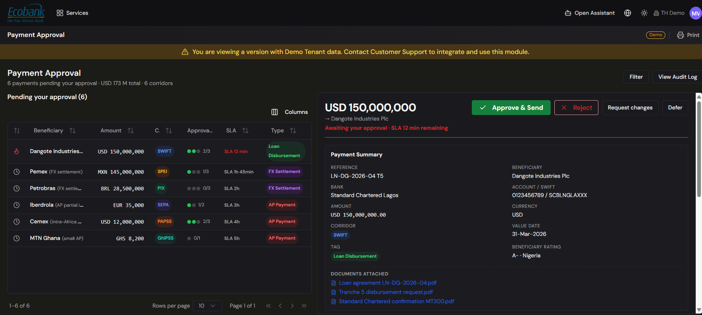

# Payment Approvals

> **Availability:** `In Preview` 👁️
> **Where to find it:** Payments › Payment Approvals
> **Who uses it:** approvers — treasurers, finance managers, and anyone with payment approval authority.
> **Permissions required:** `CashManagement.Payments` · CreateEdit **and** a sufficient payment approval level. See [Roles & Permissions](../00-getting-started/04-roles-and-permissions.md).

> 👁️ **In Preview.** This screen is in testing and available on request — contact Treasury Hub to enable it. This page describes how it works.

## Overview
Payment Approvals will be where authorized users review payments awaiting sign-off and **approve** or
**reject** them. Treasury Hub will enforce governance automatically: the person who creates a payment
cannot approve it (four-eyes), and larger or riskier payments can require **several approvers** in
sequence. Every decision will be recorded with the user, timestamp, and — for rejections — a mandatory
note, giving you a complete audit trail.

## Key concepts
- **Four-eyes (maker-checker)** — the creator of a payment cannot be its approver; a second person
  must review it.
- **Payment approval level** — the authority assigned to each user. Every payment will carry the
  **approval level it requires** (its *necessary* level), and only users at or above that level can
  approve it. Your approval level is set on your user profile by an administrator — see
  [Roles & Permissions](../00-getting-started/04-roles-and-permissions.md#access-can-be-scoped-further).
- **Multi-level approval** — a payment may need **more than one** approver. Its approval progress
  will be shown as, for example, 1 of 2 or 2 of 3, and it will only be released once all required
  approvals are in.
- **Threshold rules** — the rules (typically by amount, and configurable by type, beneficiary, or
  entity) that decide how many approvers a payment needs. These are set up with your administrator.
- **Rejection note** — a mandatory explanation captured when a payment is rejected.

## Before you start
- You will need `CashManagement.Payments` at **CreateEdit**.
- Your **payment approval level** must meet or exceed the payment's necessary level. If it doesn't,
  the Approve and Reject actions will be disabled for that payment.
- There must be payments in a **pending approval** state.

## How to use it

*The steps below describe the intended experience once this screen is live.*

### Review and approve payments
1. Open **Payments › Payment Approvals** (or select pending payments on the
   [Payment Blotter](payment-blotter.md)).
2. Select a pending payment to open its detail — beneficiary, amount, currency, corridor, value
   date, and the **approval chain** showing who has approved so far and who is still required.
3. Check the payment and any attached [invoice/document](invoices.md).
4. Click **Approve**.
5. The payment's approval progress will advance. Once all required approvals are in, it will move on
   to be sent; the [status history](payment-blotter.md) will record your approval with your name and
   the time.

To approve several at once, you will select multiple payments via their **checkboxes** in the grid and
click **Approve**. Only payments you're entitled to approve will be actioned.

### Reject a payment
1. Select the payment (or payments) you want to decline.
2. Click **Reject**.
3. In the dialog, enter the **rejection note** — this will be **required**; you'll see *"A note is
   required for rejected payments"* if it's empty.
4. Confirm. The payment will move to **Rejected**, and your note and identity will be saved to its
   history.

### When you can't approve
- If your approval level is **below** the payment's necessary level, the Approve/Reject buttons will
  be **disabled** for that payment — it must go to someone with sufficient authority.
- You will not be able to approve a payment **you created** — this is the four-eyes control working
  as intended.

## Configuration
- **Approval levels per user** and **threshold rules** (how many approvers, at what amounts/types)
  are configured by administrators. Assigning a user's payment approval level is done in the
  [Admin Console](../10-admin-console/roles-and-groups.md); see also
  [Roles & Permissions](../00-getting-started/04-roles-and-permissions.md).

## Tips & good practices
- Write **clear, specific rejection notes** — the creator relies on them to correct and resubmit.
- Approve in **batches** where appropriate to clear routine, low-value payments quickly, but review
  high-value items individually.
- Keep approval levels aligned to real authority so payments route to the right people and don't
  stall.

## Related
- [Payment Blotter](payment-blotter.md) — see approval progress and status across all payments.
- [Creating a payment](creating-a-payment.md) — what happens before approval.
- [Roles & Permissions](../00-getting-started/04-roles-and-permissions.md) — approval levels and how effective access is calculated.
- [Payments — Overview](overview.md) — the module end to end.
