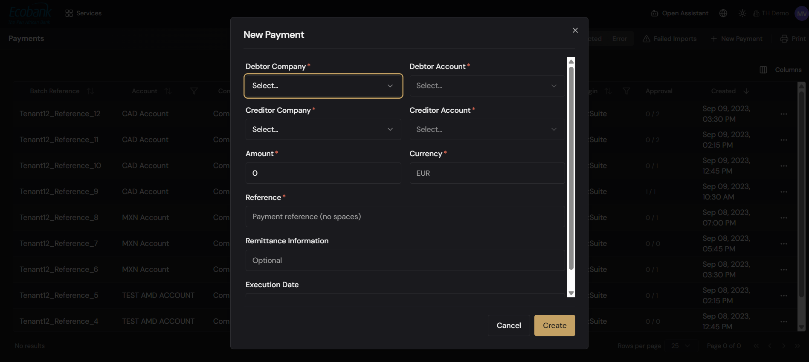

# Creating a Payment

> **Availability:** `Available` ✅
> **Where to find it:** Payments › Payment Blotter › **+ New Payment**
> **Who uses it:** treasury operations, accounts payable, anyone who raises payments.
> **Permissions required:** `CashManagement.Payments` · CreateEdit

## Overview
You raise a new payment from a single **New Payment** dialog, opened from the
[Payment Blotter](payment-blotter.md) with **+ New Payment**. In one dialog you choose who pays whom,
from and to which accounts, the amount and currency, a reference, optional remittance information, and
the execution date. When you click **Create**, Treasury Hub creates the payment and it appears in the
Payment Blotter with a status based on your approval configuration.

## Key concepts
- **Debtor Company / Debtor Account** — the legal entity paying and the account the money leaves.
- **Creditor Company / Creditor Account** — the party being paid and the account the money
  arrives in.
- **Remittance information** — the optional message that travels with the payment so the beneficiary
  can identify it (e.g. an invoice number).
- **Reference** — your own reference for the payment, used for tracking and reconciliation. It must
  not contain spaces.
- **Execution date** — the date the payment should execute (value date).

## Before you start
- You need `CashManagement.Payments` at **CreateEdit**.
- At least one **bank account** must exist to pay from — see
  [Bank Accounts](../06-reporting/bank-accounts.md).
- Have the beneficiary's bank details and the amount, currency, and value date ready.
- Remember the **four-eyes rule**: you cannot approve the payment you create, so someone else must
  sign it off. See [Payment Approvals](approvals.md).

## How to use it

### Create a payment
1. On the **Payment Blotter**, click **+ New Payment** to open the **New Payment** dialog.
2. Complete the fields, in order:
   1. **Debtor Company*** — the paying legal entity.
   2. **Debtor Account*** — the account to pay from (filtered to the selected company).
   3. **Creditor Company*** — the party you're paying.
   4. **Creditor Account*** — the beneficiary's receiving account.
   5. **Amount*** — the amount to pay.
   6. **Currency*** — the payment currency.
   7. **Reference*** — your own reference for tracking (**no spaces**).
   8. **Remittance Information** — the message for the beneficiary (optional).
   9. **Execution Date** — the date the payment should execute.
3. Click **Create** (or **Cancel** to discard).
4. The new payment appears in the blotter with a status based on your approval configuration.

Fields marked with an asterisk (*) are required.

## Validation rules
The dialog checks your entries before it will create the payment:
- The **debtor and creditor accounts must be different** — you'll see *"The debit and credit account
  cannot be the same"* if they match.
- The **amount must be greater than zero** — a negative amount shows *"The amount cannot be
  negative."*
- **Required fields** must be completed — any missing required field shows an inline error.
- The **Reference** must not contain spaces.

Enhanced pre-send validation (for example, BIC/IBAN checks and sanctions screening) is available
with the connectivity/screening add-on — see [Payments — Overview](overview.md).

## Tips & good practices
- Double-check the **debtor account** and **currency** before submitting — these drive where funds
  leave and how the payment is routed.
- Put a meaningful, unique value in **Reference** — it makes tracking and
  [reconciliation](../04-reconciliation/overview.md) far easier later.
- For recurring beneficiaries, reuse existing creditor company/account details to avoid rejections
  from mistyped bank data.

## Related
- [Payment Blotter](payment-blotter.md) — where the new payment lands.
- [Payment Approvals](approvals.md) — the sign-off the payment now needs.
- [Invoices](invoices.md) — attach the backing document for approvers.
- [Roles & Permissions](../00-getting-started/04-roles-and-permissions.md) — create vs. approve rights.
