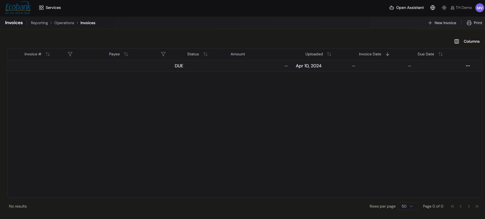

# Invoices

> **Availability:** `Available` ✅
> **Where to find it:** Reporting › Operations › Invoices
> **Who uses it:** accounts payable, treasury operations, finance team.
> **Permissions required:** `CashManagement.Invoices` · Read to view, CreateEdit to add/edit. See [Roles & Permissions](../00-getting-started/04-roles-and-permissions.md).

## Overview
The Invoices screen is a blotter of the invoices that back your payables. It lists each invoice with
its number, payee, status, amount, and key dates, so your team can see what's outstanding and due.
Keeping invoices alongside your treasury data gives approvers and auditors the context behind each
[payment](overview.md).

## Key concepts
- **Invoice #** — the invoice's identifying number.
- **Payee** — the party the invoice is payable to.
- **Status** — where the invoice stands (for example **DUE**).
- **Amount** — the invoice value.
- **Uploaded** — the date the invoice was added to Treasury Hub.
- **Invoice Date** / **Due Date** — the invoice's issue date and the date payment is due.

## Before you start
- You need `CashManagement.Invoices` at **Read** to view the list, and **CreateEdit** to add or edit
  invoices.

## How to use it

### View, sort, and filter invoices
1. Open **Reporting › Operations › Invoices**.
2. The grid lists invoices with **Invoice #, Payee, Status, Amount, Uploaded, Invoice Date,** and
   **Due Date**.
3. Click a column header's **sort** arrows to order the list, or a column's **filter** icon (on
   Invoice # and Payee) to narrow it.
4. Use **Columns** (top right) to show or hide columns, and the pagination controls at the bottom to
   change **rows per page** and move between pages.

### Add a new invoice
1. Click **+ New Invoice** (top right).
2. Complete the invoice details in the form and save. The new invoice appears in the grid with its
   **Uploaded** date.

### Row actions
- Open the **⋯** menu at the end of any row for the actions available on that invoice.

### Print
- Click **Print** (top right) to print the current view.

## Tips & good practices
- Record an invoice **before or alongside** raising its [payment](creating-a-payment.md) so
  [approvers](approvals.md) have the context they need.
- Use the **Status** and **Due Date** columns to stay ahead of what's coming due.
- Use column **filters** (Invoice #, Payee) to find a specific invoice quickly in a long list.

## Related
- [Payments — Overview](overview.md) — how invoices relate to the payment process.
- [Creating a payment](creating-a-payment.md) — raise the payment an invoice backs.
- [Operations Blotters](../06-reporting/operations-blotters.md) — the other Reporting › Operations grids.
- [Roles & Permissions](../00-getting-started/04-roles-and-permissions.md) — invoice access levels.
