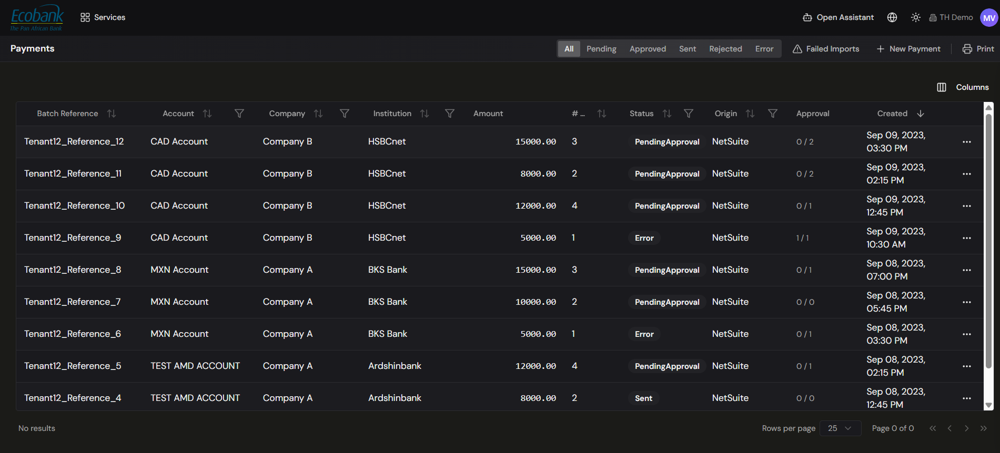

# Payment Blotter

> **Availability:** `Available` ✅
> **Where to find it:** Payments › Payment Blotter
> **Who uses it:** treasury operations, accounts payable, finance managers, approvers.
> **Permissions required:** `CashManagement.Payments` · Read to view, CreateEdit to act. See [Roles & Permissions](../00-getting-started/04-roles-and-permissions.md).

## Overview
The Payment Blotter is the main screen of the Payments module: a single list of every outbound
payment batch across your group. From here you see each payment's account, company, institution,
amount, count of items, origin, approval progress, and status — and you can open any payment to view
its full detail. It's where your team tracks the daily outflow: supplier payments, intercompany
transfers, FX settlements, loan disbursements, payroll, and taxes.

## Key concepts
- **Status tab** — a filter across the top that groups payments by where they are in their
  lifecycle (see below).
- **Batch reference** — the reference that identifies a payment (or payment batch) on the grid.
- **Origin** — where the payment came from (for example an ERP feed such as **NetSuite**, or created
  manually in Treasury Hub).
- **Approval progress** — how many of the required approvals a payment has (for example, 1 of 2).
- **Failed import** — a payment that could not be created from an inbound file or ERP feed and
  needs attention.

## The status tabs
Payments are organized into tabs so you can focus on what needs action:

| Tab | Shows |
|---|---|
| **All** | Every payment, regardless of status. |
| **Pending** | Payments awaiting approval (status `PendingApproval`) or otherwise not yet released. |
| **Approved** | Payments that have cleared approval and are ready to send. |
| **Sent** | Payments that have been dispatched to the bank. |
| **Rejected** | Payments a reviewer declined. |
| **Error** | Payments that hit a problem and need attention (status `Error`). |
| **Failed Imports** | Payments that could not be created from an inbound file or ERP feed. |

> Numbers, counterparties, and amounts shown in demos (for example, headline "payments today" or
> "total outflow" figures) are illustrative — your blotter reflects your own data.

## The payment grid
Each row is a payment (or payment batch), with these columns:

| Column | Shows |
|---|---|
| **Batch Reference** | The reference identifying the payment or batch. |
| **Account** | The debtor account the money leaves from. |
| **Company** | The paying legal entity. |
| **Institution** | The bank / financial institution. |
| **Amount** | The total amount. |
| **#** | The number of items (detail lines) in the batch. |
| **Status** | The lifecycle status (for example `PendingApproval`, `Sent`, `Error`). |
| **Origin** | Where the payment came from (for example `NetSuite`, or manual). |
| **Approval** | Approval progress as *x / y* (approvals collected / required). |
| **Created** | When the payment was created. |

Each row also has a **⋯** menu for row-level actions.

## Before you start
- You need `CashManagement.Payments` at **Read** to view the blotter. Creating payments and
  approving/rejecting require **CreateEdit** and a sufficient approval level.
- Bank accounts and beneficiaries must exist for payments to appear.

## How to use it

### Find and filter payments
1. Open **Payments › Payment Blotter**.
2. Click a **status tab** (All, Pending, Approved, Sent, Rejected, Error) — or **Failed Imports** —
   to narrow the list.
3. Use the **Columns** button to choose which columns are shown.
4. Sort a column to group, for example, all `PendingApproval` payments together.

### View a payment's details
1. Click a payment row (or use its **⋯** menu) in the blotter.
2. The **detail view** opens, showing the payment header (batch reference, status, total amount,
   account, company, and institution) and its detail lines — each with its amount, remittance
   information, and execution date.

### Create a new payment
1. Click **+ New Payment** on the blotter's toolbar.
2. Complete the [New Payment dialog](creating-a-payment.md).
3. On **Create**, the payment appears in the blotter with a status based on your approval configuration.

### Print the blotter
1. Click **Print** on the toolbar.
2. The current, filtered view is prepared for printing.

### Approve or reject a payment
Reviewing and approving/rejecting payments is handled on the dedicated **Payment Approvals**
screen, which is **👁️ In Preview**. See [Payment Approvals](approvals.md) for how the
approval workflow will work. Until it ships, the blotter is used to **create and track** payments and
follow their status.

### Manage failed imports
1. Open the **Failed Imports** tab.
2. Review each failed payment and the reason it could not be created.
3. Correct the source data and re-import, or handle the item as your process requires.

## Tips & good practices
- Work the tabs in order of urgency — clear **Error** and **Pending** first.
- Use the **Approval** column to see at a glance how many sign-offs a payment still needs.
- Check the **Failed Imports** tab regularly so nothing silently drops out of an ERP or file feed.

## Related
- [Creating a payment](creating-a-payment.md) — raise a single or batch payment.
- [Payment Approvals](approvals.md) — the dedicated approvals workspace.
- [Payments — Overview](overview.md) — how the module fits together.
- [Reconciliation](../04-reconciliation/overview.md) — matching sent payments to bank movements.
