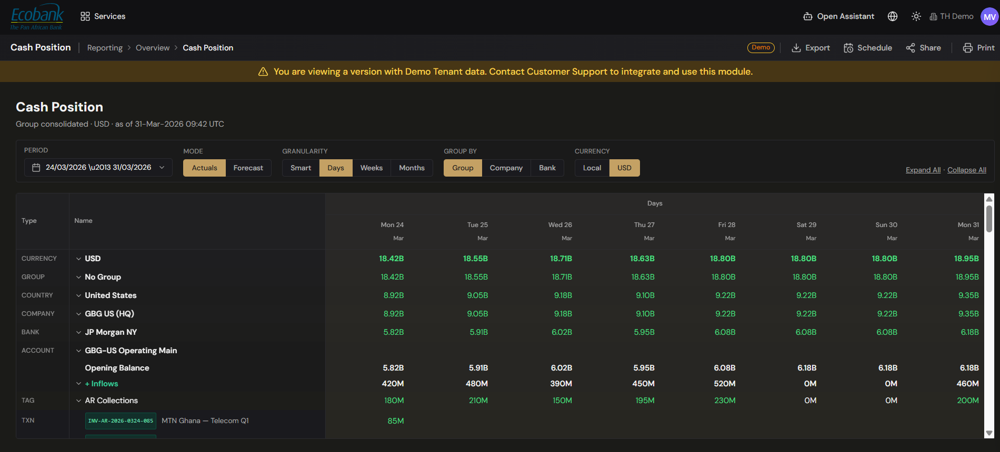

# Cash Position (Actuals)

> **Availability:** `In Preview` 👁️
> **Where to find it:** Reporting › Cash & Liquidity › Cash Position
> **Who uses it:** treasurers, cash managers, finance teams, executives.
> **Permissions required:** `CashManagement.CashPosition` · Read (and `…ExportData` · Read to export). Balances will be shown only for the companies and accounts you're entitled to. See [Roles & Permissions](../00-getting-started/04-roles-and-permissions.md).

> 👁️ **In Preview.** This screen is in testing and available on request — contact Treasury Hub to enable it. This page describes how it works.

## Overview
Cash Position will be your real-time, consolidated view of how much cash you hold and where it is. It
will show actual balances — the money that has really settled — and let you drill from a whole
currency all the way down to the individual transaction behind a number. You will choose how balances
are grouped (by entity, bank, or account) and which single currency to display everything in.

It is designed to answer, in seconds, questions like "how much USD do we hold across the group
today?", "which bank holds most of our EUR?", or "what made up yesterday's inflows on the operating
account?"

## Key concepts
- **Actuals** — settled balances and movements taken from bank statements and confirmed feeds. This
  report will show actuals only; projected figures live in [Cash Forecast](cash-forecast.md).
- **Hierarchy** — balances roll up and drill down through **Currency › Group › Country › Company ›
  Bank › Account › Tag › Transaction**.
- **Tag** — the cash-flow category on each transaction (AR Collections, AP Payments, FX Settlements,
  Payroll, Tax, etc.). Tags group inflows and outflows into meaningful lines.
- **Opening / Net Flow / Closing** — for each account and period you see the opening balance, the
  inflows and outflows that net to the period's net flow, and the resulting closing balance.
- **Display currency** — the single currency all balances convert to (e.g. **USD**), or **Local** to
  keep each account in its own currency.
- **Grouping (time)** — how columns are bucketed over time: **Days**, **Weeks**, **Months**, or
  **Smart** (fine detail near-term, coarser further out).

## Before you start
- Bank balances and movements will need to be flowing in — see [Bank Accounts](bank-accounts.md),
  [Bank Statements](bank-statements.md), and [Integrations](../02-integrations/overview.md).
- For accurate cross-currency consolidation, keep [Exchange Rates](exchange-rates.md) up to date.
- Tags will drive the inflow/outflow breakdown — the cleaner your [transaction](transactions.md)
  tagging, the more useful the drill-down.

## How to use it
*The steps below describe the intended experience once this screen is live.*

### View your consolidated position
1. Open **Reporting › Cash & Liquidity › Cash Position**.
2. Confirm the **Actuals** toggle is on (the **Forecast** toggle is off on this report).
3. Choose the **display currency** — pick a single currency (e.g. USD) or **Local**.
4. Choose the **grouping**: **Days**, **Weeks**, **Months**, or **Smart**, and the horizon
   (e.g. 3M / 6M / 12M).
5. The report shows each currency's balance across the chosen time columns, consolidated to your
   display currency.

### Change how balances are grouped
1. In the control bar, pick a **view**: **Group**, **Company**, or **Bank**.
2. The rows regroup accordingly, so you can see the position by legal entity, by banking partner, or
   consolidated for the whole group.

### Drill down to a transaction
1. Click the chevron (˅) next to any row to expand it.
2. Keep expanding through the hierarchy — **Currency › Group › Country › Company › Bank ›
   Account** — until you reach an account.
3. At the account, expand a period to see **Opening Balance**, the **+ Inflows** and **− Outflows**
   grouped by **tag**, the **Net Flow**, and the **Closing Balance**.
4. Click a tag (e.g. **AR Collections**) for a given day to list the individual transactions behind
   it, each with its description, counterparty, amount, and **source** (the feed it came from).

### Export or schedule
1. Click **Export** and choose **PDF**, **Excel**, or **CSV** to download the current view.
2. Click **Schedule** to have the position delivered automatically (for example, a daily 06:00 cash
   position to treasury and finance). See [Reporting — Overview](overview.md#schedule-a-report-for-automatic-delivery).

## Tips & good practices
- Set your display currency to your reporting currency so group totals are directly comparable.
- Use **Smart** grouping to keep the near term readable (daily) without losing the longer horizon.
- When a closing balance looks off, drill straight to the account's inflows/outflows — the tag
  breakdown usually points to the cause faster than scanning statements.
- The **source** shown on each transaction tells you whether a figure came from a statement, an API,
  or a manual entry — helpful when a number needs verifying.

## Related
- [Cash Forecast](cash-forecast.md) — the same hierarchy, projected forward.
- [Actual vs Forecast](actual-vs-forecast.md) — compare this position against what you projected.
- [Transactions](transactions.md) — the movements behind each balance.
- [Net settlements](../05-payments/overview.md) — net positions by corridor/partner (in Payments).
- [Home Dashboard](../01-home/home-dashboard.md) — the at-a-glance cash cockpit.

## In Preview
- 👁️ **Predictive liquidity insights** — proactive alerts on idle cash, concentration, and
  optimization opportunities layered over the position (in preview).
