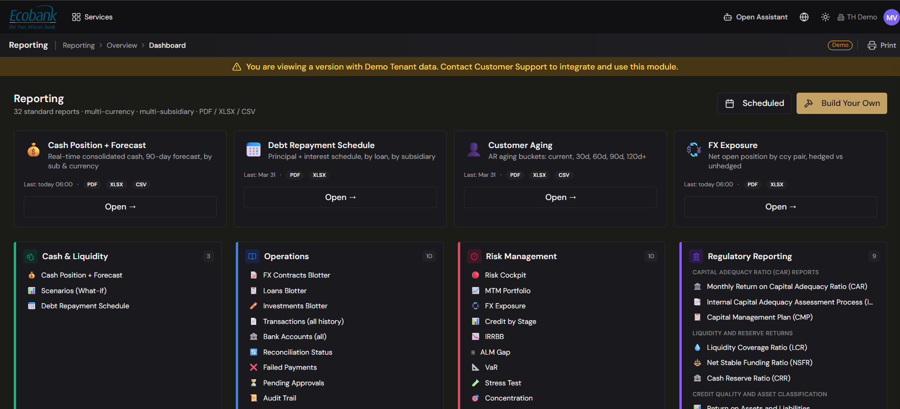

# Reporting — Overview

> **Availability:** `Available` ✅ (a set of operational reports is live) · many reports and the Reports Dashboard are `In Preview` 👁️ — see the split below
> **Where to find it:** Reporting
> **Who uses it:** treasurers, finance teams, FP&A, controllers, auditors, executives.
> **Permissions required:** `CashManagement.CashPosition.ExportData` · Read to view and generate reports. Individual reports also respect the permissions of the data they show. See [Roles & Permissions](../00-getting-started/04-roles-and-permissions.md).

## Overview
The Reporting module is your place to see the numbers that run treasury. Today it delivers a set of
**live operational reports** — the transaction, bank, invoice, reconciliation, G/L, and exchange-rate
views your team relies on every day. A wider library (cash position and forecasting, operations
blotters, risk, and regulatory reporting), the **Reports Dashboard**, and the **Build Your Own**
engine are in preview and marked `In Preview` 👁️ below.

The goal is that you spend your time reading the answer, not assembling it: the data is already
ingested, normalized, and reconciled, so a live report is a real view of your position rather than a
spreadsheet you rebuild each morning.

> 👁️ **Note on availability.** The Reports Dashboard and Audit are in testing (available on request).
> The live-vs-in-preview split below shows exactly which reports you can run today; pages for
> in-preview reports describe how they work.

## What's live today vs in preview
| Report | Status |
|---|---|
| [Transactions](transactions.md) | `Available` ✅ |
| [Bank Statements](bank-statements.md) | `Available` ✅ |
| Invoices | `Available` ✅ |
| Reconciliation Status | `Available` ✅ (see [Reconciliation](../04-reconciliation/overview.md)) |
| [G/L Postings](gl-postings-report.md) | `Available` ✅ |
| [Exchange Rates](exchange-rates.md) | `Available` ✅ |
| Reports Dashboard | `In Preview` 👁️ |
| [Audit / Regulatory & Compliance](regulatory-compliance.md) | `In Preview` 👁️ |
| [Cash Position](cash-position.md) | `In Preview` 👁️ |
| [Cash Forecast](cash-forecast.md) | `In Preview` 👁️ |
| [Actual vs Forecast](actual-vs-forecast.md) | `In Preview` 👁️ |
| [Scenarios (What-If)](scenarios-what-if.md) | `In Preview` 👁️ |
| FX / Debt / Investment blotters | `In Preview` 👁️ (see [Operations blotters](operations-blotters.md)) |
| Amortization Schedule (Debt Repayment) | `In Preview` 👁️ |
| Customer Aging | `In Preview` 👁️ |
| G/L Entry Lifecycle | `In Preview` 👁️ |
| [Risk Management](risk-management/) (all dashboards) | `In Preview` 👁️ |
| [Build Your Own Report](build-your-own.md) | `In Preview` 👁️ |

## Key concepts
- **Reports gallery** — the Reporting landing page. It shows **featured** reports, a categorized
  **library** of standard reports, and your **scheduled** reports.
- **Standard report** — a pre-built report (Cash Position, FX Exposure, Customer Aging, etc.) you can
  run as-is, with drill-down and export.
- **Build Your Own** — a custom report you define yourself: choose the data, dimensions, filters, and
  layout, then save and schedule it. See [Build Your Own Report](build-your-own.md).
- **Display currency** — the single currency all figures convert to on screen (e.g. show everything
  in USD, or in each entity's local currency).
- **Drill-down** — expanding a total to see what makes it up, down to the individual transaction.
- **Scheduled report** — a saved report set to generate and be delivered automatically (daily,
  weekly, monthly) in PDF, Excel, or CSV.

## The report sub-areas
The Reports menu is organized into four groups:

| Sub-area | What's in it |
|---|---|
| **Summary** | The reports **Dashboard** (gallery) and the **Audit** report. The **Build Your Own** button also lives on the gallery. |
| **Cash & Liquidity** | [Cash Position](cash-position.md), [Cash Forecast](cash-forecast.md), [Actual vs Forecast](actual-vs-forecast.md), and [Scenarios (What-If)](scenarios-what-if.md). |
| **Operations** | The [operations blotters](operations-blotters.md) — Transactions, Bank Accounts, FX/Debt/Investment contracts, Reconciliation Status, and more — plus [G/L Postings](gl-postings-report.md). |
| **Risk Management** | Mark-to-Market, FX Exposure, Credit Risk, IRRBB, ALM and other risk dashboards. See [Risk Management](risk-management/). |

> **Regulatory & Compliance** is **not** a separate menu section. The **Audit** report is under
> **Summary**; the prudential reports (capital, liquidity, credit quality) are In Preview and will
> appear in the reports library as they ship — see [Regulatory & Compliance Reports](regulatory-compliance.md).

## The full report library (planned)
When complete, the library will group standard reports by theme. Only the reports marked `Available` ✅
in the split above can be run today; the rest are in preview. The planned themes include:

- **Cash & Liquidity** — Cash Position + Forecast, Scenarios (what-if).
- **Operations** — FX Contracts, Loans, Investments, Transactions, Bank Accounts, Reconciliation
  Status, Failed Payments, Pending Approvals, Audit Trail.
- **Risk** — Mark-to-Market portfolio, FX Exposure, Credit Risk by stage, IRRBB, ALM gap, VaR,
  Stress Test, Concentration.
- **Debt** — Covenants, Repayment Schedule.
- **AR** — Customer Aging.
- **Financial statements** — Profit & Loss, Balance Sheet, Cash Flow Statement (direct & indirect),
  each on an Actual vs Forecast vs Budget basis.

> The report counts, KPIs, and counterparties shown in demos are illustrative examples. Which reports
> you see depends on your permissions, your enabled modules, and your data — see
> your administrator.

## Before you start
- Your data must already be flowing in through [Integrations](../02-integrations/overview.md) and, for
  the cleanest results, be [reconciled](../04-reconciliation/overview.md).
- You need `CashManagement.CashPosition.ExportData` at **Read** to view and generate reports.
  Reports only ever show data you're entitled to see (by company and account).

## How to use it

### Run a standard report
1. Open **Reporting** to land on the reports gallery.
2. Find your report in the **featured** cards or the categorized **library** (use the category
   labels to scan).
3. Click **Open report** (or the report tile).
4. Set the report's controls — date range, display currency, grouping, and any filters.
5. Read the result on screen and **drill down** into any total to see its detail.

### Export a report
1. Open the report you want.
2. Click **Export** in the report header.
3. Choose a format — **PDF**, **Excel (XLSX)**, or **CSV**.
4. The current, filtered view is generated and downloaded. (If generation takes a moment, you'll see
   a progress indicator, then the file downloads.)

### Schedule a report for automatic delivery
1. Open the report (or a saved custom report).
2. Click **Schedule**.
3. Choose the **frequency** (e.g. daily 06:00, weekly Monday, monthly on the 1st), the **format**,
   and the **recipients**.
4. Save. The report now runs on that cadence and is delivered automatically; scheduled reports are
   listed on the gallery's **Scheduled** strip.

## Tips & good practices
- Pin the reports you run most often as **featured** cards so they're one click away.
- Set the **display currency** once — every figure converts consistently, which makes group
  consolidation and comparison straightforward.
- Schedule the recurring pack (daily cash position, weekly P&L, monthly close) so it lands in
  inboxes without anyone having to remember.
- Reconcile first: a report is only as good as its data, so clear reconciliation exceptions before
  you rely on a report for decisions.

## Related
- [Build Your Own Report](build-your-own.md) — define, save, and schedule custom reports.
- [Cash Position](cash-position.md) · [Cash Forecast](cash-forecast.md) · [Actual vs Forecast](actual-vs-forecast.md) · [Scenarios (What-If)](scenarios-what-if.md).
- [Operations blotters](operations-blotters.md) and [G/L Postings](gl-postings-report.md).
- [Risk Management](risk-management/) and [Regulatory & Compliance](regulatory-compliance.md).
- [Data Repository](../03-data/data-repository.md) — the source files behind the numbers.

## In Preview
- 👁️ **Predictive insights** — proactive pattern, anomaly, and recommendation detection layered over
  your reports (seasonality, forecast-accuracy drift, concentration, liquidity optimization).
- 👁️ **Scenarios (What-If)** (Q4 2026) — model liquidity under different assumptions; see
  [Scenarios (What-If)](scenarios-what-if.md).
- 👁️ **Report-as-API & embedding** — consume any saved report as a ready-made API endpoint or embed
  it in your own dashboards; scope to be confirmed with the Treasury Hub team.
- 👁️ **Risk Management dashboards** (from Q3 2026) — see your administrator.
