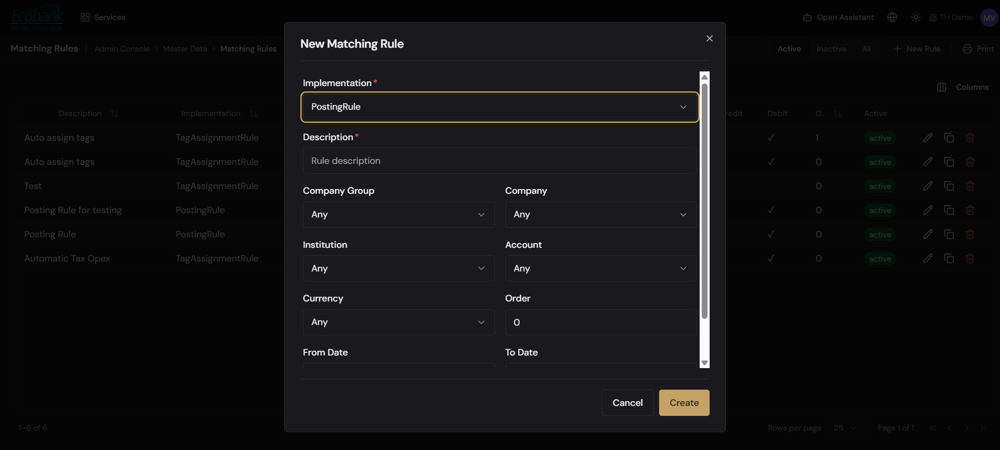

# Matching Rules

> **Availability:** `Available` ✅
> **Where to find it:** Admin Console › Master Data › Matching Rules
> **Who uses it:** administrators, treasury operations, and bookkeepers (typically Admin or Book Keeper).
> **Permissions required:** `CoreData.MatchingRules` · Read to view · Create/Edit to add, edit, or duplicate · Delete to remove.

## Overview
**Matching rules** tell Treasury Hub what to do when a transaction meets a set of conditions: either
**create G/L postings** for it or **auto-assign tags** to it. Each rule is scoped to a slice of your
data (company, account, currency, and a date range) and applies in an **order** you control. Rules
are the configurable half of [Reconciliation](../04-reconciliation/overview.md) and
[Accounting](../11-accounting/gl-postings.md) — the more precisely you scope them, the more happens
with no manual effort.

This admin screen is where you author and organize the rules. For how rules drive the reconciliation
engine day to day, see [Rules & Criteria](../04-reconciliation/rules-and-criteria.md).

## Key concepts
- **Matching rule** — a scoped definition of what to do with the transactions it covers.
- **Implementation** — the rule's type, which decides what it produces:
  - **PostingRule** — creates the G/L postings (ledger entries) for matching transactions.
  - **TagAssignmentRule** — automatically assigns [tags](tags.md) to matching transactions.
- **Scope** — the filters that decide which transactions a rule covers: **Company Group, Company,
  Institution, Account, Currency**, and the **From Date / To Date** validity window.
- **Order** — the sequence number that decides which rule is evaluated first when more than one could
  apply.
- **Active / Inactive** — a rule can be switched off without deleting it; the grid separates the two.

## Before you start
- You need `CoreData.MatchingRules` at **Read** to view, **Create/Edit** to author, and **Delete** to
  remove.
- Create the [Tags](tags.md) you'll assign (for a TagAssignmentRule) and confirm your
  [Companies and accounts](companies-and-groups.md) exist first — the rule dialog references them.

## How to use it

### Browse rules (Active / Inactive / All)
1. Go to **Admin Console › Master Data › Matching Rules**.
2. Use the **Active**, **Inactive**, and **All** tabs above the grid to switch between rules in force,
   rules switched off, and everything.
3. The grid columns are **Description**, **Implementation** (PostingRule / TagAssignmentRule),
   **Credit**, **Debit**, **Order**, and **Active**. Sort or filter to find a specific rule.
4. Use **Print** to print the current list and **Columns** to choose which columns are shown.

### Create a rule (the New Matching Rule dialog)

1. Click **+ New Rule** to open the **New Matching Rule** dialog.
2. Choose the **Implementation** (required): **PostingRule** to create G/L postings, or
   **TagAssignmentRule** to auto-assign tags.
3. Enter a **Description** (required) — a clear name so the team knows what the rule does.
4. Set the **scope** by choosing any of **Company Group**, **Company**, **Institution**, **Account**,
   and **Currency**. Leave a field blank to make the rule broader.
5. Set the **Order** (its evaluation priority) and the **From Date** / **To Date** validity window.
6. Click **Create** to save the rule, or **Cancel** to discard. The new rule appears under **Active**.

### Edit, duplicate, or delete a rule
1. **Edit** — use the edit action on a rule's row to reopen the dialog, change any field, and save.
2. **Duplicate** — use the duplicate action to create a copy you can rename and adjust; useful for a
   variant without starting over.
3. **Delete** — use the delete action on the row and confirm to remove the rule.

## Configuration
- **PostingRule vs TagAssignmentRule** — pick the implementation that matches your goal: ledger
  postings for accounting, tag assignment for classification and reporting.
- **Order** matters when several rules could apply to the same transaction — the lower-order rule is
  evaluated first, so put the most specific rules ahead of broad catch-alls.
- **From Date / To Date** let you schedule a rule to apply only within a date range (for example a
  temporary mapping or a period-specific posting rule).

## Tips & good practices
- Start **narrow** (specific company/account/currency) and broaden the scope as you gain confidence.
- Give rules **clear, descriptive names** so the reconciliation and accounting teams know what each
  one does.
- Deactivate rather than delete when experimenting — you keep the definition and can switch it back on
  from the **Inactive** tab.
- Duplicate a proven rule as the basis for a similar one instead of rebuilding it.

## Related
- [Reconciliation — Rules & Criteria](../04-reconciliation/rules-and-criteria.md) — how the engine
  applies these rules.
- [Reconciliation Overview](../04-reconciliation/overview.md) — the end-to-end matching process.
- [Accounting / G/L Postings](../11-accounting/gl-postings.md) — the ledger entries a PostingRule
  creates.
- [Tags](tags.md) — the labels a TagAssignmentRule applies.
- [Companies & Company Groups](companies-and-groups.md) — the scope entities rules reference.
