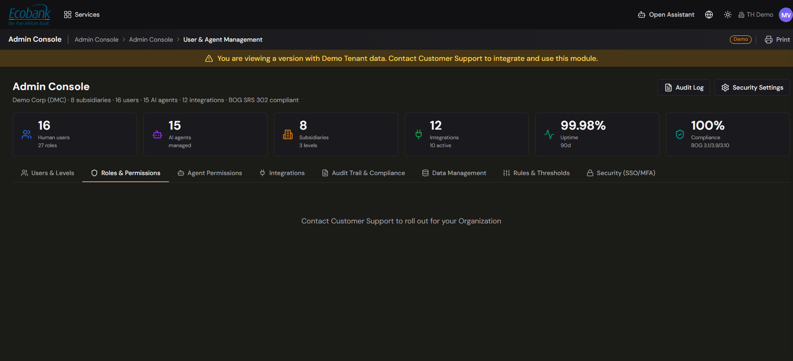

# Roles & Groups

> **Availability:** `In Preview` 👁️ (the role/permission-matrix editor and group management in the **User & Agent Management** console). Roles are **assigned** to users in [User Management](user-and-agent-management.md#manage-users-live); the five-level permission model is described in [Roles & Permissions](../00-getting-started/04-roles-and-permissions.md).
> **Where to find it:** Admin Console › User & Agent Management › Roles & Permissions (`In Preview` 👁️)
> **Who uses it:** administrators.
> **Permissions required:** `AdminAndSettings.UserManagement` · Admin

## Overview
**Roles** decide what people can do. The live access model — the **five permission levels** applied
per module — is documented in [Roles & Permissions](../00-getting-started/04-roles-and-permissions.md)
and works today; you assign roles to users in live
[User Management](user-and-agent-management.md#manage-users-live).

The screen described here — the **role/permission-matrix editor**, the built-in role catalog with a
**"Can Approve?"** column, organization levels, and **group** management — is part of the
**User & Agent Management** console, which is `In Preview` 👁️ (premium plan). Read the "how to use
it" steps below in the conditional; they describe the upgraded console, not a live screen.

> **Live vs In Preview.** The five-level, per-module model **stays** and is live. The permission
> matrix editor and the 27-role catalog with "Can Approve?" belong to the **In Preview** console — do
> not treat them as the current live RBAC.

## The five permission levels (live model)
Every module in a role is set to exactly one level. This is the live model — see
[Roles & Permissions](../00-getting-started/04-roles-and-permissions.md) for the full detail.

| Level | What it allows |
|---|---|
| **No Access** | The module is hidden and its screens can't be opened. |
| **Read** | View only — no create, edit, or delete. |
| **Create/Edit** | View, create, and edit records. |
| **Delete** | View, create, edit, and delete records. |
| **Admin** | Full access, including configuration. |

When a user holds several roles, their **effective level** for each module is the **highest** granted
by any role.

## Key concepts
- **Role** — a named set of permissions, stored as a matrix of *module × level*.
- **Permission module** — an area of the platform whose access is controlled separately (e.g.
  `CashManagement.Payments`, `CoreData.Companies`).
- **"Can Approve?"** — in the In-Preview console, a flag on each role indicating whether it carries
  approval authority.
- **Organization level (L1/L2/L3)** — in the In-Preview console, the Country / Hub / Group hierarchy a
  role or user can be scoped to.
- **Group** — a grouping of users for organization; it doesn't grant permissions itself.
- **Super Admin** — a user who bypasses all permission checks.

## The role catalog (In Preview)
The In-Preview console ships a catalog of **27 predefined roles** you can use as-is, each shown with a
**"Can Approve?"** column. Common examples:

| Role | Typical access | Can approve? |
|---|---|---|
| **Admin** | Full access, including user management and configuration. | Yes |
| **User Manager** | Invite and manage users at the same level or below. | No |
| **Cash Manager** | Access to assigned accounts and cash operations. | Depends on setup |
| **Payment Preparer** | Enter and prepare payments (cannot approve). | No |
| **Payment Approver** | Approve payments according to threshold rules. | Yes |
| **Book Keeper** | View and edit posting rules; approve postings. | Depends on setup |
| **View Only** | Read-only access to assigned accounts. | No |

> This is a subset of the 27 roles — treat it as illustrative. The exact catalog and each role's
> "Can Approve?" value are shown in the console.

## How to use it (In Preview)
The steps below describe the upgraded **User & Agent Management** console (`In Preview` 👁️).

### Create or edit a role
1. Go to **Admin Console › User & Agent Management › Roles & Permissions**.
2. Add a role, or open an existing one to edit it.
3. Enter a unique **role name** and set its **"Can Approve?"** flag.
4. In the **permission matrix**, set the level for each module (No Access / Read / Create/Edit /
   Delete / Admin). Rows are modules; columns are levels.

   

   *The In-Preview User & Agent Management console — Roles & Permissions matrix.*

5. Save. The role becomes assignable to users.

### Assign a role to users
Roles are assigned on the live
[User Management](user-and-agent-management.md#configure-a-users-roles-access-and-approval-level)
screen — open a user, add the role, and save. This part is `Available` ✅ today.

### Groups (In Preview)
Groups let you organize users into teams (for example by department or region) so they're easier to
find and manage. A group is a label plus its membership; it doesn't grant permissions on its own —
permissions always come from roles. In the console you add or edit a group, name it, and choose its
members.

## Tips & good practices
- Build roles around **jobs to be done**, not individuals — that keeps the matrix small and reusable.
- Keep **Admin** on `AdminAndSettings.UserManagement` limited to a small, trusted group.
- Separate **preparing** from **approving** payments (Payment Preparer vs Payment Approver) to enforce
  segregation of duties.
- Use groups to mirror your **org chart**; use roles to mirror **what people do**.

## Related
- [Roles & Permissions](../00-getting-started/04-roles-and-permissions.md) — the live five-level model
  and module list.
- [User & Agent Management](user-and-agent-management.md) — live user management and the In-Preview console.
- [Master Data](master-data.md) — which roles typically get access to which reference data.

## In Preview
- 👁️ **Role/permission-matrix editor** — author custom roles across the module matrix.
- 👁️ **27-role catalog with "Can Approve?"** and organization levels (L1/L2/L3 = Country/Hub/Group).
- 👁️ **Group management** — organize users into teams in the console.
