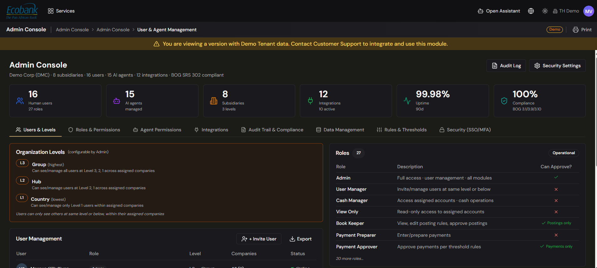

# User & Agent Management

> **Availability:** `Available` ✅ (basic **User Management**) · `In Preview` 👁️ (the rich **User & Agent Management** console)
> **Where to find it:** **User Management** — Admin Console › Master Data › User Management · **User & Agent Management** console — `In Preview` 👁️ (premium plan)
> **Who uses it:** administrators and user managers.
> **Permissions required:** `AdminAndSettings.UserManagement` · Admin

## Overview
Treasury Hub manages the people who use your tenant in two places, and it's important to know which is
which:

- **User Management (`Available` ✅)** — the live screen under **Admin Console › Master Data › User
  Management**. Use it to add users, assign roles, scope company/account access, and manage each
  person's lifecycle. Everything in [Manage users (live)](#manage-users-live) below works today.
- **User & Agent Management console (`In Preview` 👁️)** — a richer, upgraded console that adds
  organization levels, a full permission matrix, agent permissions, integrations, audit/compliance,
  data management, rules & thresholds, and security (SSO/MFA). It is a premium plan and is in testing
  and available on request. See [The User & Agent Management console (In Preview)](#the-user--agent-management-console-in-preview).

> **Don't confuse the two.** The live per-module access model is the **five-level** model documented
> in [Getting Started › Roles & Permissions](../00-getting-started/04-roles-and-permissions.md). The
> organization levels (L1/L2/L3) and 27-role catalog described further down belong to the **In
> Preview** console, not to the live platform.

## Key concepts
- **User** — a person who can sign in to your tenant, identified by email.
- **Role** — a named bundle of permissions. A user can hold several; see [Roles & Groups](roles-and-groups.md).
- **Company / account access** — the legal entities and bank accounts a user is allowed to see.
- **Payment approval level** — a numeric authority used by [multi-level payment approvals](../05-payments/approvals.md)
  to decide which payments a user can approve.

## Before you start
- You need `AdminAndSettings.UserManagement` at **Admin** level.
- Set up your [Companies and Company Groups](companies-and-groups.md) and bank accounts first — you
  assign access against them.
- Decide which [roles](roles-and-groups.md) each person needs.

## Manage users (live)
The following works today on **Admin Console › Master Data › User Management**.

### Add or invite a user
1. Go to **Admin Console › Master Data › User Management**.
2. Add a new user and enter their **email address**. Optionally pre-assign one or more **roles**.
3. Save. The new user appears in the list; open them to finish configuring access (below).

> Each user is unique by email — entering an address that already exists returns an error.

### Configure a user's roles, access, and approval level
1. Click a user to open their detail.
2. **Roles** — add or remove roles. The user's effective permission for each module is the
   **highest** level any of their roles grants (the five-level model — see
   [Roles & Permissions](../00-getting-started/04-roles-and-permissions.md)).
3. **Account access** — grant access **by company** (all accounts under the selected companies) or
   **by individual account** (specific accounts only).
4. **Payment approval level** — set the numeric level that governs which payments this user can
   approve.
5. Save. Changes take effect the next time the user loads a screen.

### Manage the user lifecycle
Set a user's status to control access without losing their history:
- **Active** — can sign in and work normally.
- **Suspended** — access is temporarily blocked; can be reactivated later.
- **Deactivated** — access is removed (for example, when someone leaves).

Save the change; it's preserved in the audit history. To remove a user entirely, use the **Delete**
action and confirm.

## The User & Agent Management console (In Preview)
The upgraded **User & Agent Management** console brings user, role, and agent governance together in
one place. It is `In Preview` 👁️ (a premium plan; the platform advises "Contact Customer Support to
roll out for your Organization") — read the following in the conditional; these capabilities are not
yet live.

*The In-Preview User & Agent Management console — user grid with **+ Invite User** and **Export**.*

The console will be organized into tabs:

- **Users & Levels** — the user grid (with **+ Invite User** and **Export**) plus **Organization
  Levels** L1/L2/L3, mapped to **Country / Hub / Group**, for scoping users across an org hierarchy.
- **Roles & Permissions** — a catalog of **27 roles** (Admin, User Manager, Cash Manager, View Only,
  Book Keeper, Payment Preparer, Payment Approver, and more) with a **"Can Approve?"** column, and a
  full permission matrix. See [Roles & Groups](roles-and-groups.md).
- **Agent Permissions** — assign and review what each AI agent may do.
- **Integrations** — connections managed alongside user governance.
- **Audit Trail & Compliance** — user and permission changes for review and certification.
- **Data Management** — data-related controls within the console.
- **Rules & Thresholds** — approval thresholds and governance rules.
- **Security (SSO/MFA)** — single sign-on with corporate identity providers and multi-factor
  authentication.

> The organization levels (L1/L2/L3) and the 27-role catalog above are part of this **In Preview**
> console. They do **not** replace the live five-level per-module model in
> [Getting Started › Roles & Permissions](../00-getting-started/04-roles-and-permissions.md).

### Agent management (In Preview)
Alongside human users, the console is designed to let administrators grant and oversee permissions for
AI agents the same way they do for people. A key governance principle applies: **agents operate,
humans decide — no agent can approve a payment or other action without human authorization.** See
[Agents](../09-agents/overview.md) for the wider agent plans.

## Tips & good practices
- Grant the **least privilege** needed; it's easier to add access than to explain over-access in an
  audit.
- **Suspend** rather than delete when someone is temporarily away, so their history and settings
  remain intact.
- Review the user list periodically for access certifications.

## Related
- [Roles & Groups](roles-and-groups.md) — the roles you assign, and the In-Preview permission matrix.
- [Roles & Permissions](../00-getting-started/04-roles-and-permissions.md) — the live five-level model.
- [Payment Approvals](../05-payments/approvals.md) — where payment approval levels are used.
- [Companies & Company Groups](companies-and-groups.md) — the entities you scope access to.

## In Preview
- 👁️ **User & Agent Management console** — organization levels (L1/L2/L3), the 27-role permission
  matrix with "Can Approve?", agent permissions, integrations, audit & compliance, data management,
  rules & thresholds, and security (SSO/MFA).
- 👁️ **Agent management** — permissions and oversight for AI agents.
