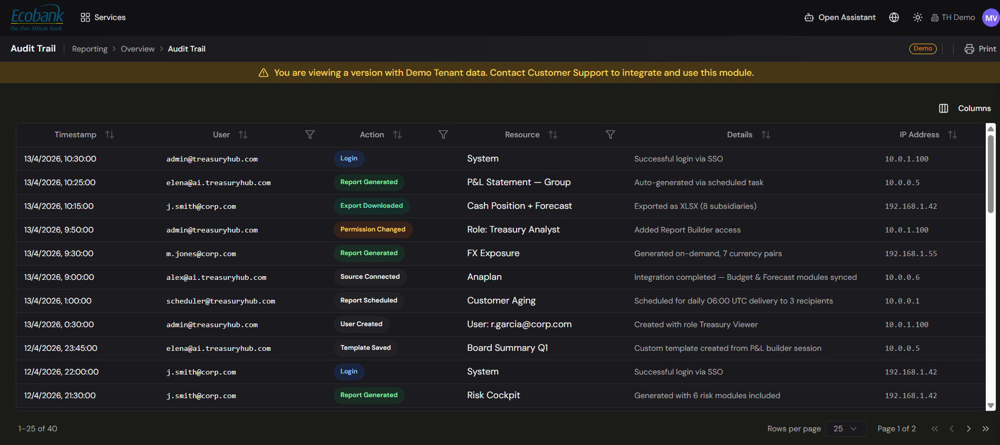

# End-to-End Audit Trail

> **Availability:** `In Preview` 👁️
> **Where to find it:** Reporting › Overview › Audit Trail (a filterable audit log). A per-record timeline inside each record's detail panel is planned (see In Preview).
> **Who uses it:** auditors, financial controllers, compliance, treasury operations.
> **Permissions required:** Read on the relevant module; auditors will typically have read access across modules plus the audit trail. See [Roles & Permissions](../00-getting-started/04-roles-and-permissions.md).

> 👁️ **In Preview.** This is in testing and available on request — contact Treasury Hub to enable it. This page describes how it works.

## Overview
The **audit trail** will be the immutable record of everything that happened to a transaction — every
step, every change, who or what did it, and when. It will let you follow a single item from the moment
it arrived in the platform all the way to its record in your ERP, and back again, which is exactly
what auditors and compliance teams need.

Auditability is built into the platform's [workflow model](../00-getting-started/03-core-concepts.md#everything-is-a-workflow):
every workflow step records who did what, when, and the outcome. This page explains how the trail
*will* work for accounting and posting activity once the module is live.

## Key concepts
- **Event** — one immutable record of a single action (for example *created*, *approved*,
  *exported*, *matched*, *rejected*, *escalated*).
- **Immutable / append-only** — events are never edited or deleted; a correction is a new event, so
  the history is complete and tamper-evident.
- **Actor** — who performed the action: a **user** (with their identity) or an **AI agent** (with the
  agent's identity).
- **ID chain** — the linked identifiers that connect a transaction across every phase and system, so
  you can trace it end to end.
- **Correlation ID** — the single identifier that ties all of one transaction's events together
  across the whole pipeline.
- **Retention policy** — how long the trail is kept, configurable to your regulatory needs.

## The ID chain — following a transaction end to end
Each transaction will keep a chain of identifiers that links every stage together:

```
Transaction → Reconciliation → Journal Entry → Approval → ERP Export → ERP Entry
 (ingestion)    (matching)       (generated)    (workflow)  (sent)       (recorded in ERP)
```

Because these are linked, you will be able to navigate in both directions:

- **Drill down (backwards):** from an entry recorded in the ERP → back to its journal entry → back
  to the reconciliation → back to the original bank movement.
- **Drill up (forwards):** from an ingested bank movement → forward to reconciliation → forward to
  the journal entry → forward to the ERP record.
- **Cross-entity:** when a transaction affects more than one company (for example intercompany), the
  trail connects the entries across all the entities involved.

## What each event records
Every event will capture a consistent set of fields:

| Field | What it records |
|---|---|
| **Timestamp** | When it happened (UTC, to the millisecond). |
| **Actor** | The user or AI agent that performed the action. |
| **Action** | The type of operation (created, approved, exported, matched, rejected, escalated…). |
| **Status change** | The transition — previous status → new status. |
| **Snapshot** | The data as it stood at the moment of the action. |
| **Context** | For an AI action: its reasoning and confidence score. For a user: session details such as IP. |

## How to use it
*The steps below describe the intended experience once this is live.*

### Browse the audit log
1. Open **Reporting › Overview › Audit Trail**.
2. The log lists events with **Timestamp, User, Action** (e.g. Login, Report Generated, Export
   Downloaded, Permission Changed, Source Connected, User Created, Template Saved), **Resource,
   Details,** and **IP Address**, newest first.
3. Sort any column, and use the **column filters** (User, Action, Resource) to narrow the log; use
   **Columns** to show/hide fields and **Print** to print the current view.



> A per-record **timeline in the detail panel** (following one item end to end across modules) is
> in preview — see In Preview below.

### Trace a transaction across systems
1. From any event, use the **linked reference** to jump to the connected record in another phase
   (for example from a journal entry to its source reconciliation, or forward to its ERP record).
2. Follow the chain in either direction until you reach the point you need — the original bank
   movement or the final ERP entry.

### Filter and search the trail
1. Use the timeline filters to narrow by **phase** (ingestion, reconciliation, journal entry,
   approval, export).
2. Filter by **actor** to see only a specific user's or AI agent's actions.
3. Search for a specific reference or ID to jump straight to it.

### Export the trail for an external audit
1. Open the trail for the record or period you need.
2. Choose the **export** option and select **PDF** or **CSV**.
3. Hand the exported record to your auditors, or feed it into your GRC (governance, risk, and
   compliance) tooling.

## Tips & good practices
- Because the trail is **append-only**, treat it as your single source of truth for "who changed
  what" — there is no hidden edit history to chase.
- When reviewing an **AI agent's** decision, check the recorded **reasoning and confidence score** to
  understand why it approved or escalated an item.
- Agree your **retention period** with your auditors up front (many regulations expect several years;
  seven or more is a common baseline) and confirm it is configured for your organization.
- Use **cross-entity** tracing for intercompany items so both sides of a transaction are reviewed
  together.

## Related
- [G/L Postings](gl-postings.md) — postings whose history the trail records.
- [Journal Entries](journal-entries.md) — entry generation and approvals recorded in the trail.
- [Posting to your ERP](erp-integration.md) — export and matching events.
- [Roles & Permissions](../00-getting-started/04-roles-and-permissions.md) — who can view the trail.
- [Reconciliation](../04-reconciliation/overview.md) — matching events feed the same trail.

## In Preview
- 👁️ **Consolidated Transaction Timeline** — a single unified view of every event for any transaction,
  with phase and actor filters in one place.
- 👁️ **Compliance query API** — programmatic access to the audit trail for external GRC tools.
