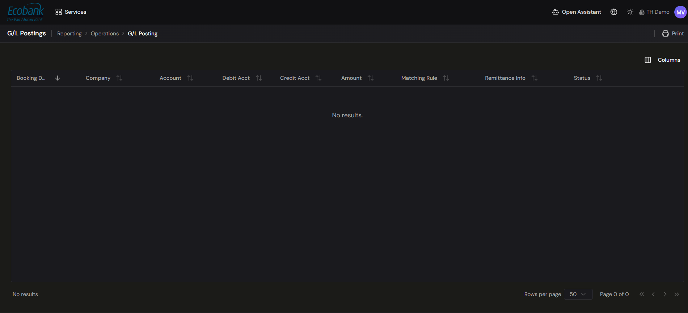

# G/L Postings

> **Availability:** `Available` ✅ (viewing)
> **Where to find it:** Reporting › Operations › **G/L Posting**
> **Who uses it:** accountants, finance team, treasury operations, auditors.
> **Permissions required:** `CashManagement.TransactionsPosting` · Read (view). See [Roles & Permissions](../00-getting-started/04-roles-and-permissions.md).

## Overview
A **G/L posting** is the accounting record that a treasury transaction produces — the debit and
credit lines that eventually land in your general ledger. The G/L Postings screen shows, in one
grid, how each transaction has been turned into a posting so your finance team can see what has been
recorded, what is still pending, and against which accounts.

The grid is **read-only**: you can **view, sort, print, and choose columns**, but you cannot add or
edit postings here — each posting is generated automatically by a **PostingRule** (see below). How
postings flow onward to your ERP is described in
[Chart of Accounts & Rules Engine](coa-rules-engine.md), [Journal Entries](journal-entries.md), and
[Posting to your ERP](erp-integration.md).

## Key concepts
- **Posting** — the accounting entry created for a transaction, expressed as a **debit and credit
  account** for the amount.
- **PostingRule** — the configured rule that generates the posting and decides which accounts a given
  transaction posts to. Each posting shows its rule in the **Matching Rule** column, which links back
  to the rule that produced it. See [Chart of Accounts & Rules Engine](coa-rules-engine.md) and
  [Matching Rules](../10-admin-console/matching-rules.md).
- **Debit Acct / Credit Acct** — the general-ledger accounts a posting is booked to.
- **Posting status** — where the posting is in its lifecycle (see below).

## How a transaction becomes a posting
Postings are the accounting output of the platform's normal data flow — see
[Core Concepts › Everything is a workflow](../00-getting-started/03-core-concepts.md#everything-is-a-workflow).
In outline:

1. **A transaction is captured or reconciled.** Data arrives through
   [Integrations](../02-integrations/overview.md) and, where relevant, is matched in
   [Reconciliation](../04-reconciliation/overview.md).
2. **A PostingRule is applied.** The rule determines the debit and credit accounts for that type of
   transaction (by transaction type, counterparty, currency, entity, amount, or tags).
3. **The posting appears in the grid**, showing its debit and credit accounts, amount, the rule that
   produced it (**Matching Rule**), and its status.

## Posting statuses
Each posting carries a status so you can see what still needs attention. Typical statuses include:

| Status | Meaning |
|---|---|
| **Generated / Pending** | The posting has been created but is not yet confirmed in the ledger or ERP. |
| **Posted** | The posting has been recorded (and, where the ERP add-on is enabled, confirmed in the ERP). |
| **Mismatch / Exception** | The posting could not be matched or was rejected downstream and needs review. |

> Any figures, account codes, or counterparties you see in demo screens are illustrative. Your grid
> shows your own transactions and your own chart of accounts.

## How to use it

### View the G/L Postings grid
1. Open **Reporting › Operations › G/L Posting**.
2. The grid loads your postings, one row per posting, with these columns:

   | Column | Shows |
   |---|---|
   | **Booking Date** | The date the posting was booked. |
   | **Company** | The legal entity the posting belongs to. |
   | **Account** | The account the underlying transaction relates to. |
   | **Debit Acct** | The general-ledger account debited. |
   | **Credit Acct** | The general-ledger account credited. |
   | **Amount** | The posting amount. |
   | **Matching Rule** | The **PostingRule** that generated the posting (links to the rule). |
   | **Remittance Info** | The remittance message carried by the transaction. |
   | **Status** | Where the posting stands in its lifecycle. |

3. Sort any column to group, for example, all **Pending** postings together. The grid is read-only —
   there is no add or edit here, because postings are generated by their PostingRule.

### Choose columns and print
1. Use **Columns** to choose which columns are shown.
2. Use **Print** to prepare the current view for printing or handoff to accounting.

## Tips & good practices
- Sort by **Status** regularly to keep on top of postings that have not yet been confirmed.
- Watch the **Mismatch / Exception** status — these usually point to a rule gap or an ERP rejection
  that needs a quick fix upstream.
- Use the **Matching Rule** link to open the **PostingRule** behind a posting and understand *why* it
  posted the way it did before changing any rules.

## Related
- [Chart of Accounts & Rules Engine](coa-rules-engine.md) — how events map to accounts.
- [Journal Entries](journal-entries.md) — how full entries are generated and approved.
- [Posting to your ERP](erp-integration.md) — sending postings to NetSuite / SAP.
- [End-to-end audit trail](audit-trail.md) — the immutable history behind every posting.
- [Reconciliation — ERP Posting](../04-reconciliation/erp-posting.md) — posting reconciled items.
- [Reconciliation](../04-reconciliation/overview.md) — where many postings originate.

## In Preview
- 👁️ **AI-generated postings & journal entries** — automatic entry generation from every module,
  reviewed and approved by your team. See [Journal Entries](journal-entries.md).
